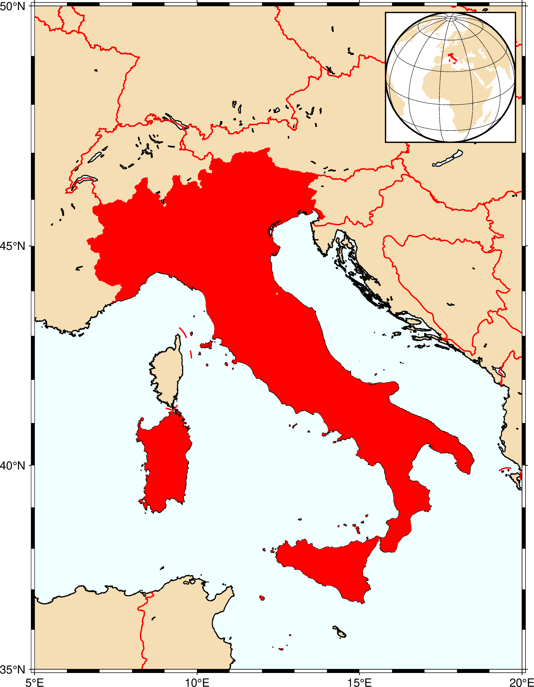
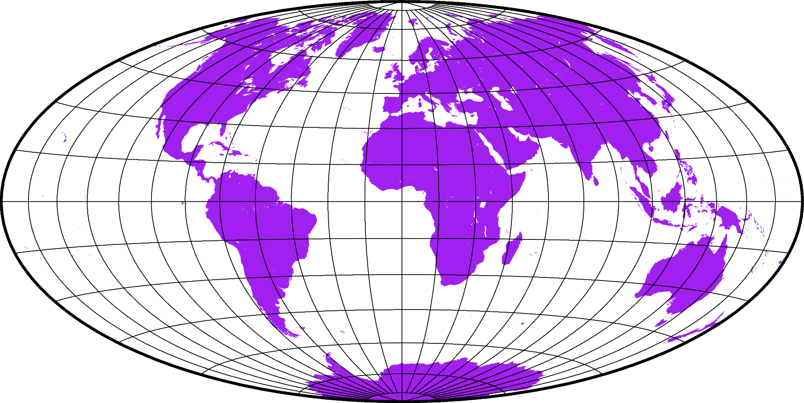
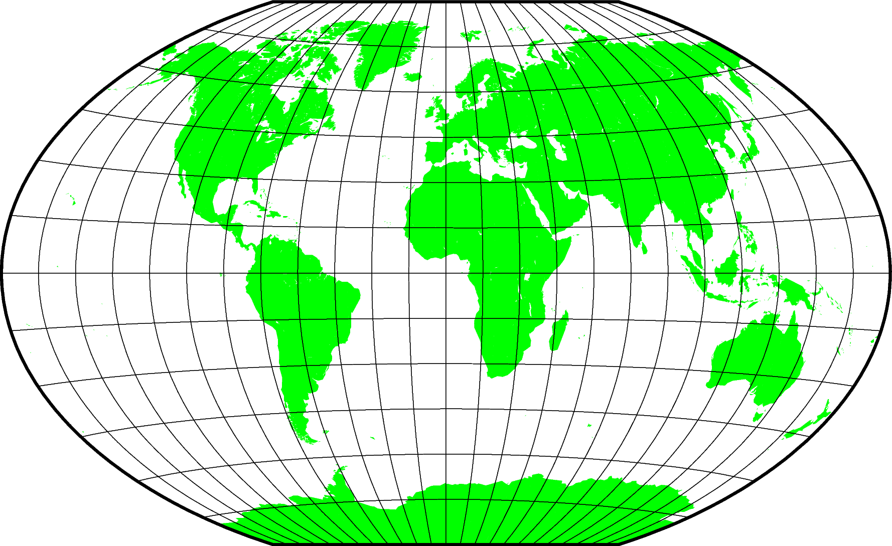
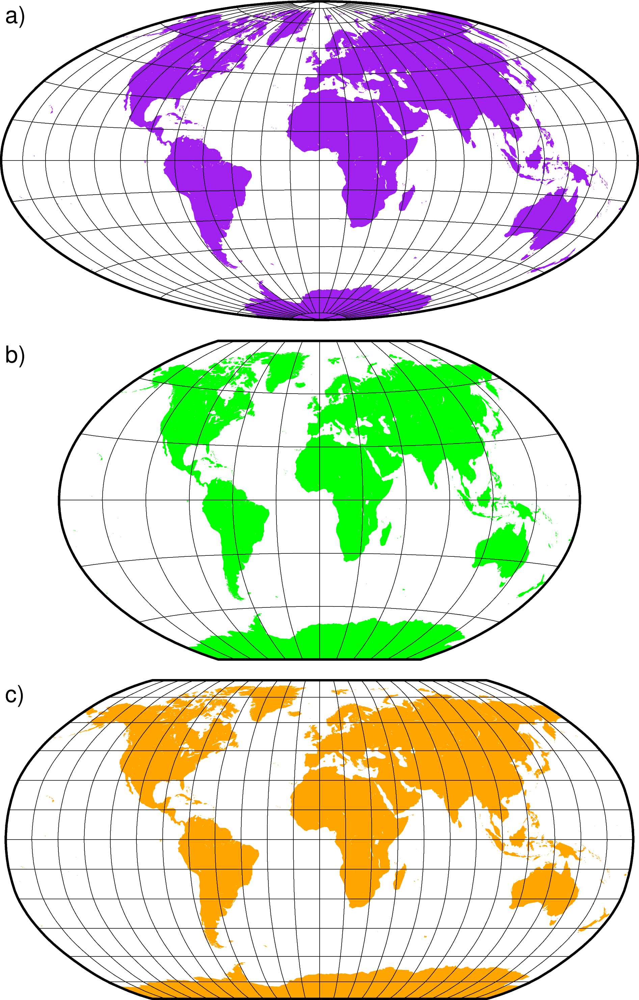

# GMT Basics

**Instructor:**
[Max Jones](https://github.com/maxrjones)

**Resources**

* My Google Slides on [GMT Basics](https://docs.google.com/presentation/d/113JgVEMLuIMQq021VMiYyi0Z1EEBlo-RvbkUBK0DmLs/edit#slide=id.p)

**Tasks**

* Where to find help for a GMT module
* Map projections
* Make several location maps using coastlines

**Common Problems**:

* You have spaces between a GMT option (e.g., -R) and its argument (e.g., -R 0/5/0/5).
* You forgot to enclose a GMT modern session between **gmt begin** and **gmt end** calls.

Note: You can clean up the modern environment with

```
gmt clear sessions
```

**Breakout Room Tasks**

* Make a map of your country based on our Italy example
* Make a 2x2 subset plot of 4 global projections

**Products**

This session may build one or more scripts.  We are doing this together live but if you need to
go back and check you can examine my scripts here.  We recommend you work through the course
with us first before you open our scripts - they are there to help you later.

1. Our final map of Italy:



2. Our two maps from a multi-figure script:




3. Our final subplot example:


