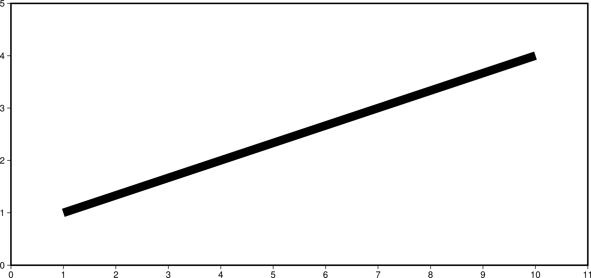

# Plotting Lines, Polygons & Symbols

The goals of this session is to show how to draw lines & polygons, how to make use of the rich pen and fill options and finally introduce you to the rabbit hole that are symbols.

## Topics

Links to [the documentation](https://docs.generic-mapping-tools.org/):

* [Line styles](https://docs.generic-mapping-tools.org/latest/cookbook/features.html#specifying-pen-attributes)
* [Polygon filling](https://docs.generic-mapping-tools.org/latest/cookbook/features.html#specifying-area-fill-attributes)
* [Symbols](https://docs.generic-mapping-tools.org/latest/plot.html#s)
* [Custom Symbols](https://docs.generic-mapping-tools.org/latest/cookbook/custom-symbols.html#custom-plot-symbols)

## Lines & Polygons

First steps: Open your editor and create a text file with two coordinates and have GMT plot it.

```
#!/usr/bin/env bash

# Create the text file with two coordinates
cat > line.txt << END
 1 1
10 4
END

# Plot the line
gmt begin lines png
  gmt plot line.txt
gmt end show
```

Lets have a closer look at the GMT commands used:

`gmt begin` starts a GMT modern mode session and `lines` is the name of the resulting file. If you want another output file format than PDF, specify it after the file name. Here we want a PNG file so we specify `png`.

`gmt plot` calls the plotting module and `line.txt` is the text file we want to plot.

`gmt end` finalises the plot and outputs the result. Adding `show` opens your plot right away with your systems default viewer for that file type.

Now execute the script and see what we get:


Not really what we expected to see. The `plot` module needs some more arguments:

```
 gmt plot line.txt -JX22c/10c -R0/11/0/5 -Ba1 -W9p
```

`-JX22c/10c` specifies a cartesian plot 22cm wide by 10cm tall while `-R0/11/0/5` defines the data ranges in X (0 to 11 units) and Y (0 to 5 units) direction. 

`-Ba1` is a very simple argument for annotations. The [-B option](https://docs.generic-mapping-tools.org/latest/gmt.html#b-full) is a powerful beast. Here we just tell it to place annotations every one plot unit.

`-W9p` defines the pen to be plotted 9 point wide. One point equals 1/72 inch.

Lets run the script again:



Way better. Now add some color to the line. That's rather easy by adding the color to the pen definition:

`-W9p,red`


You can specify colors by name as we did here but also by RGB triplets, RGB Hex values, HSV, CMYK and grey values. See [gmtcolors](https://docs.generic-mapping-tools.org/latest/gmtcolors.html#gmtcolors) for more details and a chart with all 663 unique color names that can be used in GMT.

### Line styling

What if you're not happy with a solid line and want a dashed or a dotted line? GMT has a shorthand for those as well. Just append `,-` for dashed or `,.` for dotted lines after the color in the pen definition.

`-W9p,red,-` gives you an automatic dashed line:


while `-W9p,red,.` gives you an automatic dotted line:


You can combine those as you want, e.g. `-W9p,red,.-`


But you can also have finer control by directly specifying the length of dashes and gaps with a syntax of `<length of dash>_<length of gap>`, e.g. `-W9p,red,20_20`


## Drawing symbols

At the end we will generate this figure


In your text editor create a script with

```
	#!/usr/bin/env bash
	# Examples of symbols with different filling and outline pens

	gmt begin symbols png
		echo 0 0 | gmt plot -R-1/6/-1/6 -JX15/15 -BWSen+t"Symbols & pens" -Ba2g1 -Ggreen -Sc0.75c
		echo 1 0 | gmt plot -Ggreen -W1,black -Sc0.75c
		echo 2 0 | gmt plot -Ggreen -W1,0/130/0 -Sc0.75c
		echo 3 0 | gmt plot -Ggreen -W1,black,dashed -Sc0.75c
		echo 4 0 | gmt plot -Ggreen -W1,black,-. -Sc0.75c
		echo 5 0 | gmt plot -G- -W1,0/130/0 -Sc0.75c
	gmt end show
```

This plots circles with the same size (0.75 cm diameter) and different colors and outline pens


adding these more plots other symbols (star, diamond, square, etc...)

```
	echo 0 1 | gmt plot -Gred -W1,black -Sa0.75c
	echo 1 1 | gmt plot -Gred -W1,black,dashed -Sc0.75c
	echo 2 1 | gmt plot -Gred -Sd0.75c
	echo 3 1 | gmt plot -Gred -W0.5,black -Sh0.75c
	echo 4 1 | gmt plot -W2,red -S+0.75c
	echo 5 1 | gmt plot -Gred -Ss0.75c
```

but when things start to be more interesting is when we make use of GMT's own custom symbols.
There is a default set of [`custom symbols`](https://docs.generic-mapping-tools.org/latest/cookbook/custom-symbols.html?highlight=custom%20symbols#custom-plot-symbols) 
that comes with GMT and several more contributed by users ([`wales and dolphins`](https://docs.generic-mapping-tools.org/latest/users-contrib-symbols.html#biology-symbols),
[`geological`](https://docs.generic-mapping-tools.org/latest/users-contrib-symbols.html#structural-geology-symbols))
and you can even build your own symbols using the symbols [`macro language`](https://docs.generic-mapping-tools.org/latest/cookbook/custom-symbols.html?highlight=custom%20symbols#the-macro-language)


Add this and we get another row, this time with the custom symbols
```
	echo 0 3 | gmt plot -Gbrown -W1 -Skflash/1.5c
	echo 1 3 | gmt plot -Gblue -W1 -Skhurricane/1.5c
	echo 2 3 | gmt plot -Ggray -W1 -Skpacman/1.5c
	echo 3 3 | gmt plot -Gbrown -W1 -Skstar3/1.5c
	echo 4 3 | gmt plot -Gyellow -W1 -Sksun/1.5c
	echo 5 3 | gmt plot -Gred -W1 -Skvolcano/1.5c
```


For even more elaborated symbols we can use EPS (encapsulated Postscript) files directly.
These two are stored in the GMT server and will be download directly by GMT (the leading ``@`` is
the responsible for that automatic download).

```
	echo 1 5 | gmt plot -Sk@gallo/3.5c
	echo 4 5 | gmt plot -Sk@sardinha/6c
```

The full script that plots all symbols displayed at the begining of this topic can be found here [`symbols.sh`](symbols.sh).

## Polygon filling

To exemplify how to paint polygons we will extract the outline of Italia and use it in our example. In the editor
create a script called *italia_I.sh* with

```
#!/usr/bin/env bash
# Extract the ouline of mainland Italia and use it as example for filling polygons
# The more cryptic command to extract the polygon is due to the fact that for demonstration
# sake we only want the main country polygon (i.e., drop all islands and islets)

gmt pscoast -EIT -M | gmt convert -C+l3000 -bof > italia.bin 
gmt begin italia_I png
	gmt plot italia.bin -bi2f -R6/19/37/47.5 -JM15 -Baf -W1 -Gp32+r100+fblue
	echo 14 39 | gmt plot -Skmeca/3c -G100 -Wfaint
gmt end show
```

Here we are using a [`patern`](https://docs.generic-mapping-tools.org/latest/cookbook/predefined-patterns.html#predefined-bit-and-hachure-patterns-in-gmt) picked from the GMT pattern collection for the polygon fill
(but we could have used simply a constant color like for example *-Glightblue*). Run the script and we get.


## Group exercise

You will be split into teams to work on an exercise:

1. Discuss with your team which commands and options you would use
2. Work together to make a script that generates the desired plot
3. If you have any questions, ask on the Slack chatroom

**Make a maps similar to this but with different colors and symbols**


1. Use different line styles to draw the itlian border
2. Paint Italy with different colors and patterns
3. Replace the *beach ball* with other symbols.
4. Try to plot a different symbol for each of *beach ball* positions

Don't look at *one* [`solution`](italia_II.sh).
