# Plotting Lines, Polygons & Symbols

The goal of this session is to show how to draw lines & polygons, how to make use of the rich pen and fill options and finally introduce you to the rabbit hole that are symbols.

## Topics

Links to [the documentation](https://docs.generic-mapping-tools.org/):

* [Line styles](https://docs.generic-mapping-tools.org/latest/cookbook/features.html#specifying-pen-attributes)
* [Polygon filling](https://docs.generic-mapping-tools.org/latest/cookbook/features.html#specifying-area-fill-attributes)
* [Symbols](https://docs.generic-mapping-tools.org/latest/plot.html#s)
* [Custom Symbols](https://docs.generic-mapping-tools.org/latest/cookbook/custom-symbols.html#custom-plot-symbols)

## Lines & Polygons

First steps: Open your editor and create a text file with two coordinates and have GMT plot it.

```
#!/usr/bin/env bash

# Create the text file with two coordinates
cat > line.txt << END
 1 1
10 4
END

# Plot the line
gmt begin lines png
  gmt plot line.txt
gmt end show
```

Lets have a closer look at the GMT commands used:

`gmt begin` starts a GMT modern mode session and `lines` is the name of the resulting file. If you want another output file format than PDF, specify it after the file name. In our case we want a PNG file so we specify `png`.

`gmt plot` calls the plotting module and `line.txt` is the text file we want to plot.

`gmt end` finalises the plot and outputs the result. Adding `show` opens your plot right away with your systems default viewer for that file type.

Now execute the script and see what we get:


Not really what we expected to see. The `plot` module needs some more arguments:

```
 gmt plot line.txt -JX22c/10c -R0/11/0/5 -Ba1 -W9p
```

`-JX22c/10c` specifies a cartesian plot 22cm wide by 10cm tall while `-R0/11/0/5` defines the data ranges in X (0 to 11 units) and Y (0 to 5 units) direction. 

`-Ba1` is a very simple argument for annotations. The [-B option](https://docs.generic-mapping-tools.org/latest/gmt.html#b-full) is a powerful beast. Here we just tell it to place annotations every one plot unit.

`-W9p` defines the pen to be plotted 9 point wide. One point equals 1/72 inch.

Lets run the script again:


Way better. Now add some color to the line. That's rather easy by adding the color to the pen definition:

`-W9p,red`


You can specify colors by name as we did here but also by RGB triplets, RGB Hex values, HSV, CMYK and grey values. See [gmtcolors](https://docs.generic-mapping-tools.org/latest/gmtcolors.html#gmtcolors) for more details and a chart with all 663 unique color names that can be used in GMT.

### Line styling

*Note*: See also the chapter [3.14. Specifying pen attributes](https://docs.generic-mapping-tools.org/latest/cookbook/features.html#specifying-pen-attributes) in the cookbook.

What if you're not happy with a solid line and want a dashed or a dotted line? GMT has a shorthand for those as well. Just append `,-` for dashed or `,.` for dotted lines after the color in the pen definition.

`-W9p,red,-` gives you an automatic dashed line:


while `-W9p,red,.` gives you an automatic dotted line:

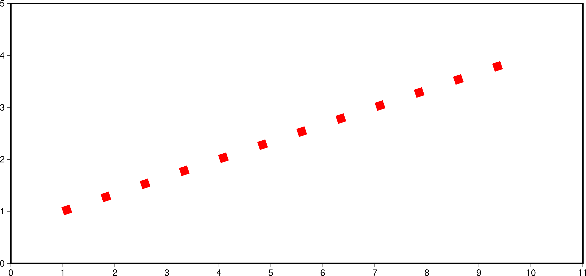

You can combine those as you want, e.g. `-W9p,red,.-`

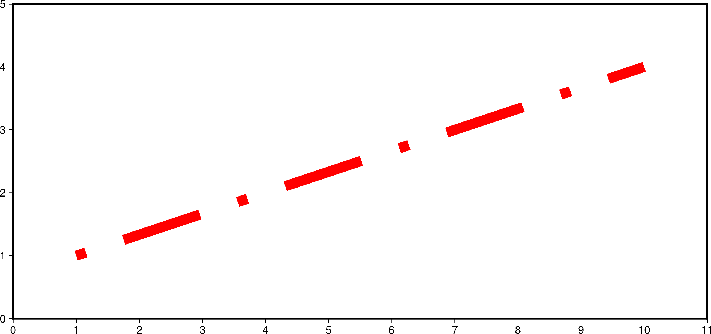

But you can also have finer control by directly specifying the length of dashes and gaps with a syntax of `<length of dash>_<length of gap>`, e.g. `-W9p,red,20_20`


And of course you can daisychain those to something like this: `-W9p,red,20_20_5_20`

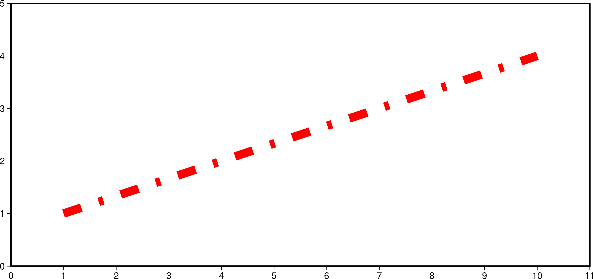

### Line caps

A quick note on line caps. The [PostScript option `PS_LINE_CAP`](https://docs.generic-mapping-tools.org/latest/gmt.conf.html#term-PS_LINE_CAP) determines how the ends of a line segment will be drawn. You have the choice between

* **butt** cap – no projection beyond the end of the path (default)
* **round** cap – a semicircular arc with diameter equal to the line-width is drawn around the end points
* **square** cap – a half square of size equal to the line-width extends beyond the end of the path

```
#!/usr/bin/env bash

cat > line.txt << END
 1 1
10 4
END

gmt begin lines png
  gmt plot line.txt -JX22c/10c -R0/11/0/5 -Ba1 -W9p,red,20_20_5_20 --PS_LINE_CAP=butt
  gmt plot line.txt -W1p,white,20_20_5_20
gmt end show
```

The thin white line illustrates the extend of the input coordinates:

`--PS_LINE_CAP=butt`

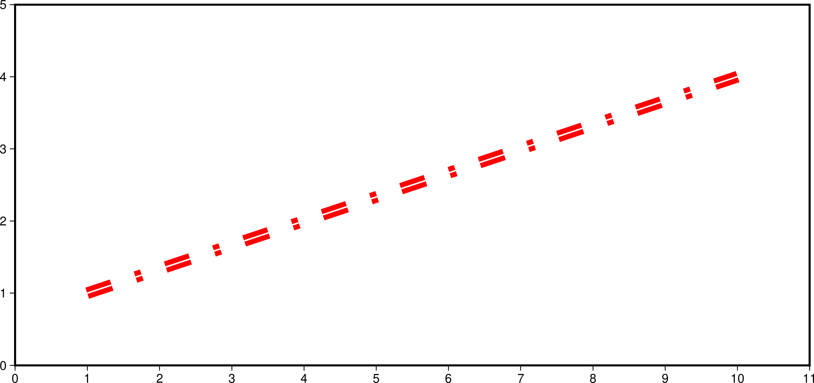

`--PS_LINE_CAP=round`

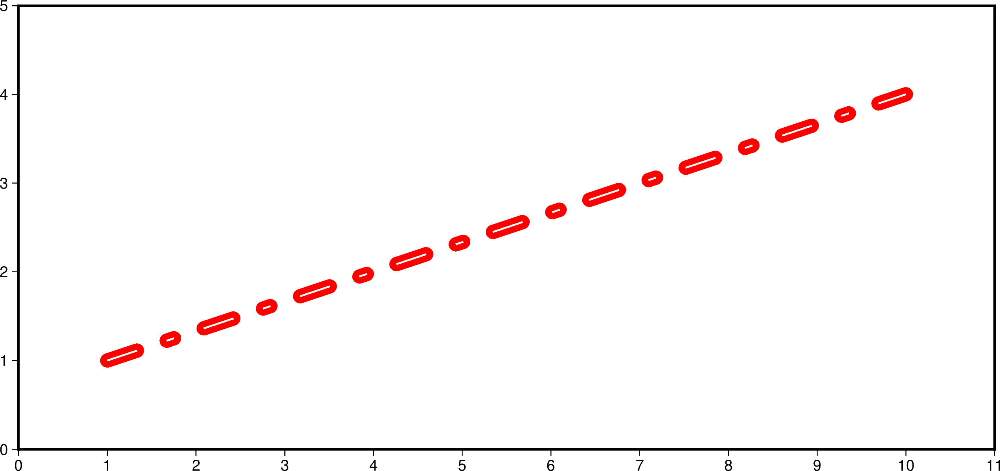

`--PS_LINE_CAP=square`

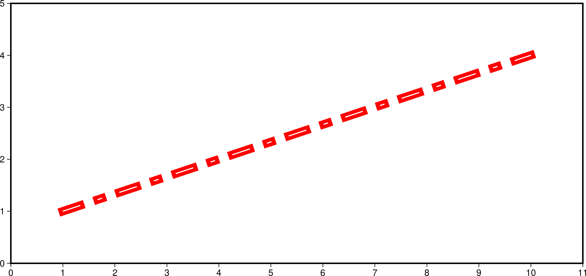

### Bezier Splines

Normally, all PostScript line drawing is implemented as a linear spline, i.e., we simply draw straight line-segments between the map-projected data points. Use the `+s` modifier after your pen definition to render the line using Bezier splines for a smoother curve. 

*Note*: The spline is fit to the projected 2-D coordinates, not the raw user coordinates (i.e., it is not a spherical surface spline).

```
#!/usr/bin/env bash

cat > line.txt << END
 1 1
 5 1
10 4
END

gmt begin lines png
  gmt plot line.txt -JX22c/10c -R0/11/0/5 -Ba1 -W9p,red 
gmt end show
```

Linear spline: `-W9p,red`

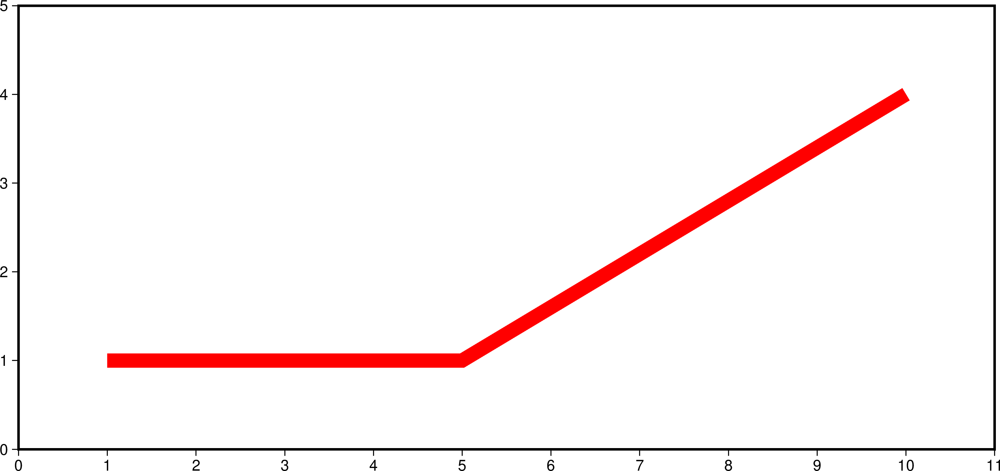

Bezier spline: `-W9p,red+s` - the only difference is the `+s` at the end

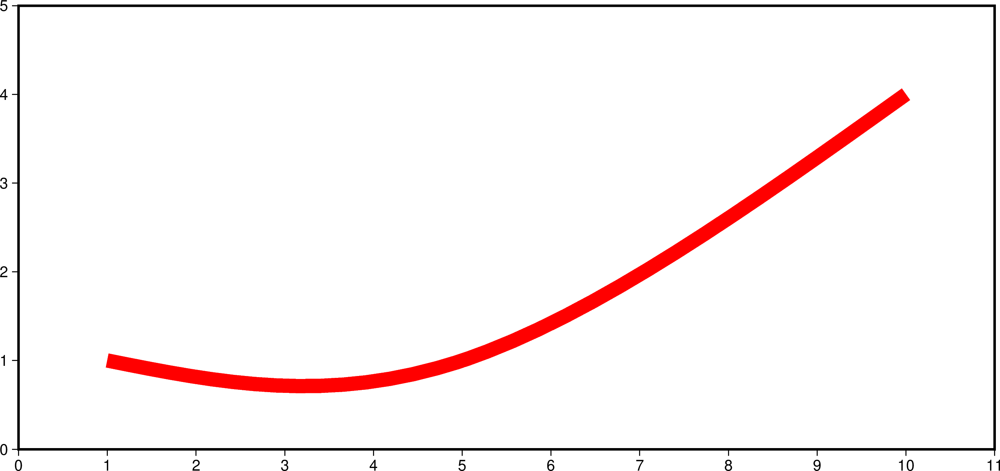

### Closed Polygons

Closed polygons are similar to lines. The only difference is that the first coordinate is repeated again at the end of the text file. This signals GMT that it should plot a closed polygon. 

```
#!/usr/bin/env bash

cat > line.txt << END
 1 1
10 4
 1 4
 1 1
END

gmt begin lines png
  gmt plot line.txt -JX22c/10c -R0/11/0/5 -Ba1 -W9p,red 
gmt end show
```

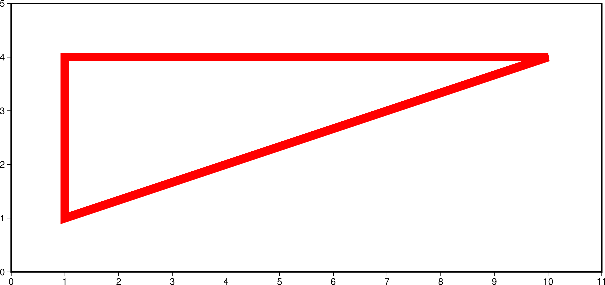

Observe how we get a proper line joint at (1|1) closing the polygon nicely. 

## Polygon fill

Filling Polygons is easy. Just add the [fill argument `-G`](https://docs.generic-mapping-tools.org/latest/cookbook/features.html#gfill-attrib) and off you go. `-G` takes colors or patterns. 

First the simplest case: we want to fill our polygon with a `lightorange` color so we specify `-Glightorange`:

```
#!/usr/bin/env bash

cat > line.txt << END
 1 1
10 4
 1 4
 1 1
END

gmt begin lines png
  gmt plot line.txt -JX22c/10c -R0/11/0/5 -Ba1 -W9p,red -Glightorange
gmt end show
```

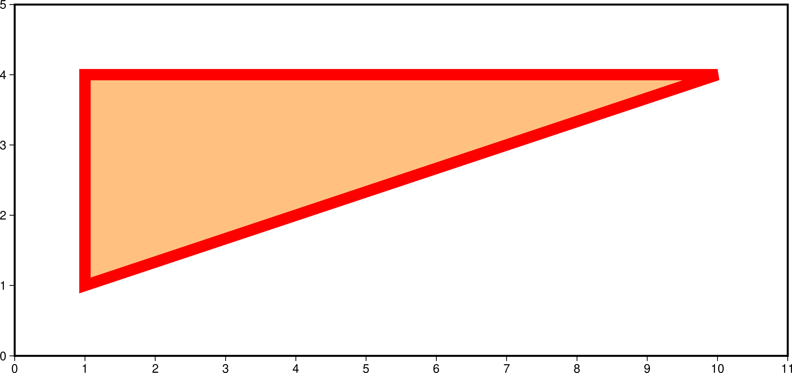

On to the patterns. Have a look at `-GP|p` in the cookbook chapter [3.16. Specifying area fill attributes](https://docs.generic-mapping-tools.org/latest/cookbook/features.html#gfill-attrib) and choose one of the [90 predefined patterns](https://docs.generic-mapping-tools.org/latest/cookbook/predefined-patterns.html#predefined-bit-and-hachure-patterns-in-gmt) that come with GMT.

Lets take pattern 19 and specify `-Gp19` instead of `-Glightorange`:

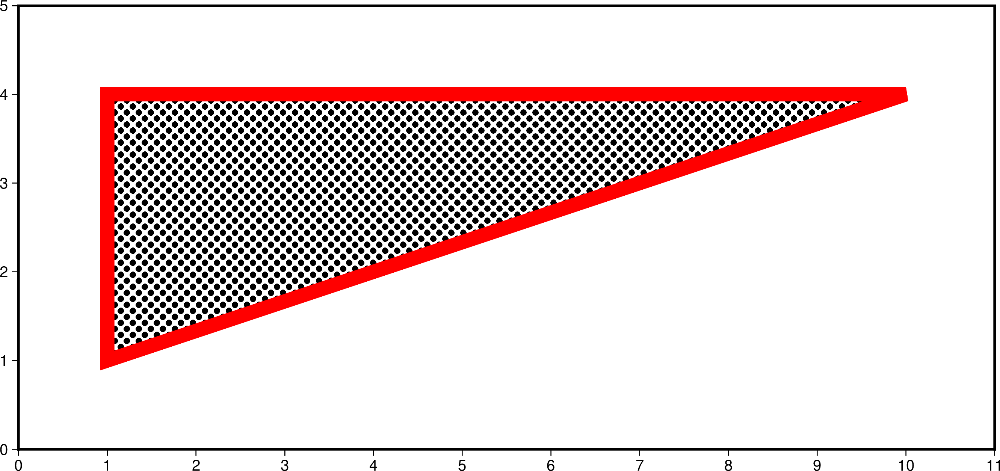

And of course there is a way to add color to a pattern. Lets say we want the same `lightorange` color for pattern 19. `-Gp19+flightorange` replaces the black with the orange color. Again, check chapter [3.16. Specifying area fill attributes](https://docs.generic-mapping-tools.org/latest/cookbook/features.html#specifying-area-fill-attributes) in the cookbook for details.

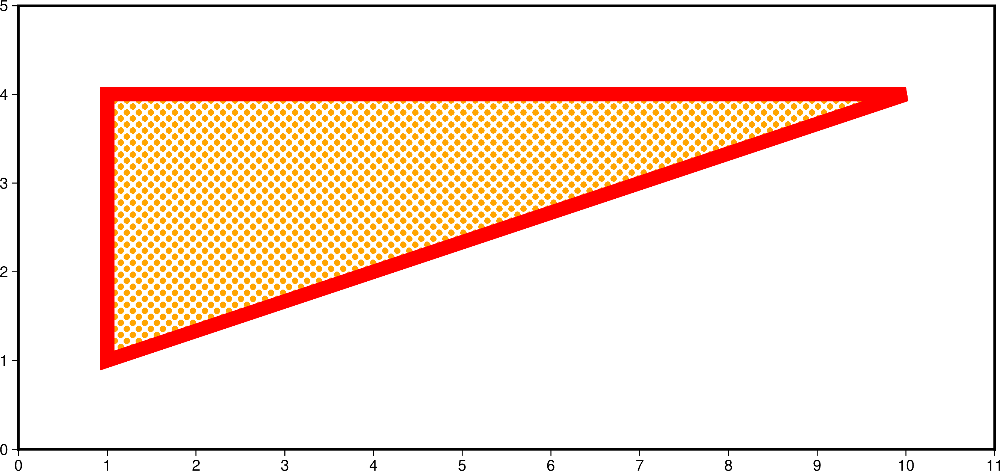

## Excercise 1

* Draw a polygon around the coordinate system origin. Don’t forget to change the range.
* Draw the line in a 10 point wide green pen
* Fill the polygon with a blue zig-zag pattern

## Symbols

GMT comes with 14 basic geometric symbols and offers endless possibilities when diving into the world of custom symbols. First we will use some of the basic symbols and later we will examine custom symbols in greater detail.

Read up on the [`-S` argument in `plot`](https://docs.generic-mapping-tools.org/latest/plot.html#s) and study chapter [18. Custom Plot Symbols](https://docs.generic-mapping-tools.org/latest/cookbook/custom-symbols.html#custom-plot-symbols) in the cookbook.

For our first example we will make a nice background map with the help of the  [`coast` module](https://docs.generic-mapping-tools.org/latest/coast.html) and plot a star from the basic geometric symbols and a volcano symbol from the built-in custom symbols on top of it. You are already familiar with the `-W` pen definition and the `-G` fill definition to change both outline and fill.

```
#!/usr/bin/env bash

gmt begin symbols png
  gmt coast -JM0/20c -R-87/50/-57/60 -W0.5p,grey43 -Sgrey88 -A300 -B
  echo -10 -30 | gmt plot -Sa2c -W2p,blue -Gorange
  echo -40 20 | gmt plot -Skvolcano/2c -W2p,red -Gorange 
gmt end show
```

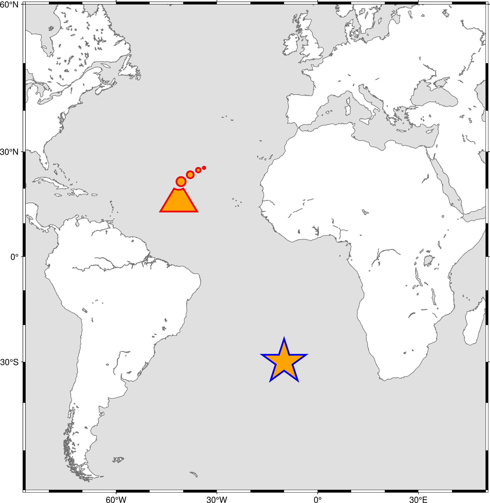

### Custom-built Symbol

As a quick demo how to build your own custom symbol we are going to build a map marker you might recognize from your favourite mapping application:


Having a look at the cookbook chapter [18. Custom Plot Symbols](https://docs.generic-mapping-tools.org/latest/cookbook/custom-symbols.html#custom-plot-symbols) gives you everything you need to build a custom plot symbol. We will layer some basic shapes (diamond and circle) to achieve the desired goal.

Create a new text file and name it `map_marker.def`. This will be our custom symbol definition file. First we plot a diamond with a black outline:

```
0 0.354 0.707 d -W0.1,black
```

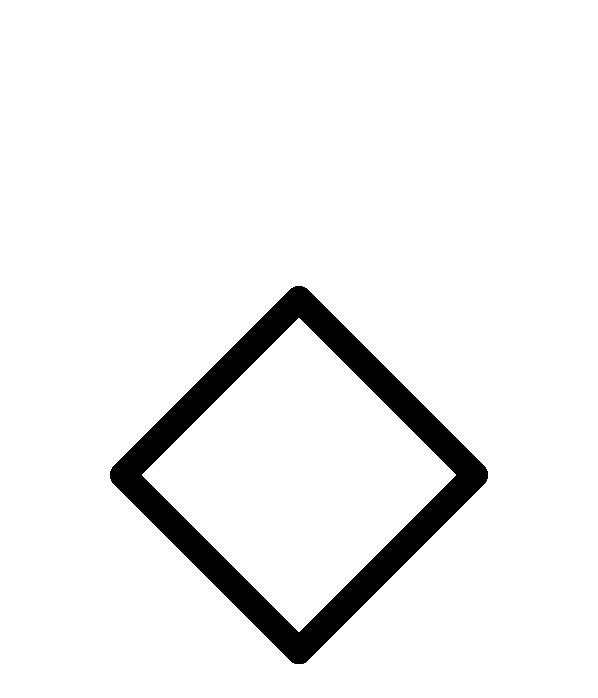

Then on to the upper part of the symbol, a nice round circle:

```
0 0.354 0.707 d -W0.1,black
0 0.707 1     c -W0.1,black
```

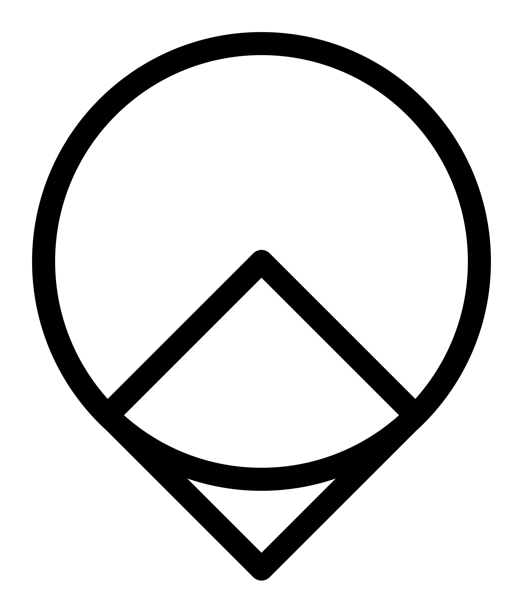

As we got the basic shape nailed down, we can now move on to the fill. It is just a repeat of the two shapes already in our file. But we are making sure that there is only fill and no outlines (`-W-` defines no outline) as it would break our illusion of a solid symbol. First the diamond:

```
0 0.354 0.707 d -W0.1,black
0 0.707 1     c -W0.1,black
0 0.354 0.707 d -W- -Gorange
```

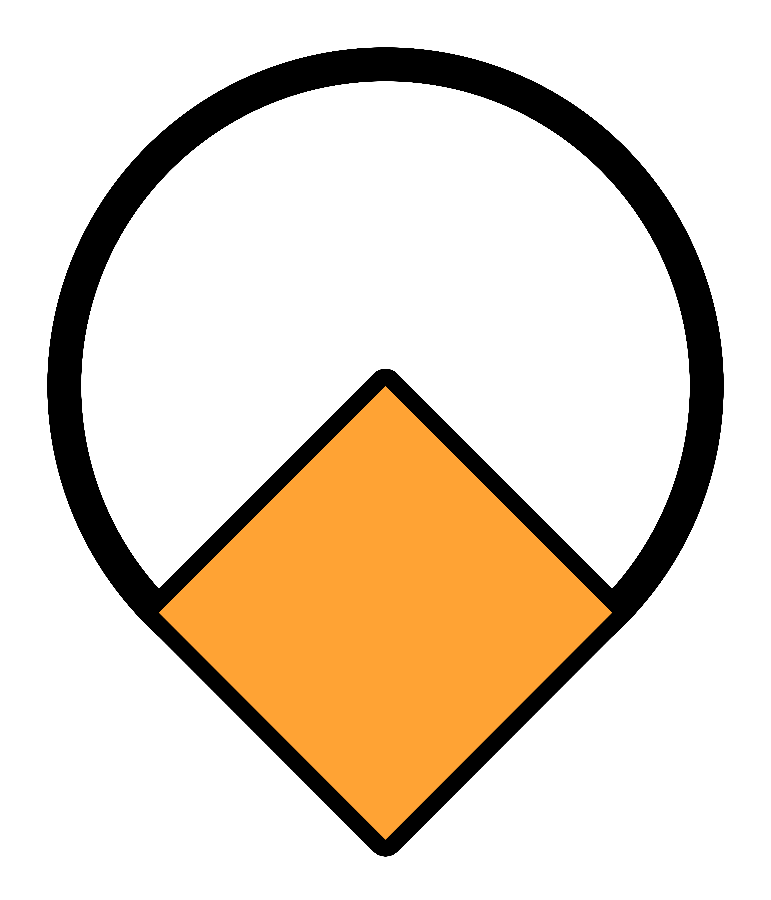

Followed by the circle:

```
0 0.354 0.707 d -W0.1,black
0 0.707 1     c -W0.1,black
0 0.354 0.707 d -W- -Gorange
0 0.707 1     c -W- -Gorange
```

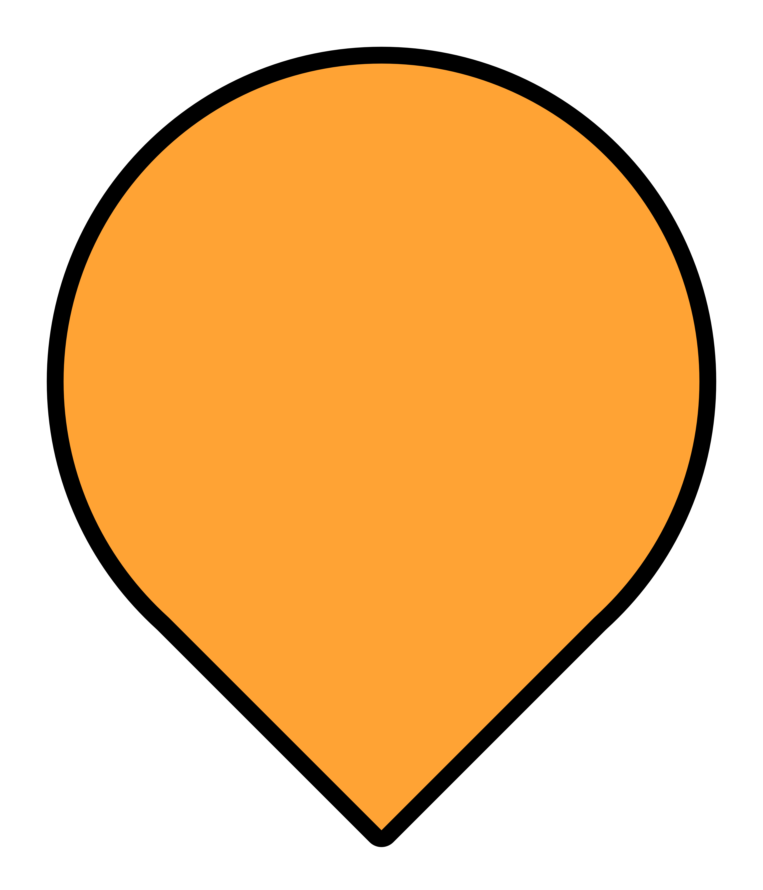

As a finishing touch we add the black dot which is just another circle with a smaller radius and we have our finished custom map marker symbol:

```
0 0.354 0.707 d -W0.1,black
0 0.707 1     c -W0.1,black
0 0.354 0.707 d -W- -Gorange
0 0.707 1     c -W- -Gorange
0 0.707 0.4   c -Gblack
```


Lets place our newly-built marker on our map:

```
#!/usr/bin/env bash

gmt begin symbols png
  gmt coast -JM0/20c -R-87/50/-57/60 -W0.5p,grey43 -Sgrey88 -A300 -B
  echo -10 -30 | gmt plot -Sa2c -W2p,blue -Gorange
  echo -40 20 | gmt plot -Skmap_marker/1c 
gmt end show
```

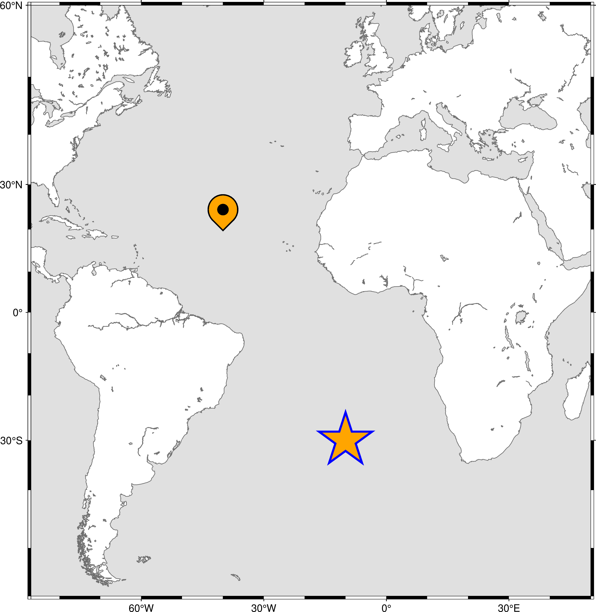

## Excercise 2

* Make a plot of the continent you are living on 
* Build a simple house custom symbol and place it where you live

## Quoted Lines

Lets revisit lines once more. They can also have labels to show information associated with them. The possibilities are very powerful, so have a good look at chapter [19. Annotation of Contours and “Quoted Lines”](https://docs.generic-mapping-tools.org/latest/cookbook/contour-annotations.html#annotation-of-contours-and-quoted-lines) in the cookbook.

First we generate a text file with two line segments and plot those on our background map from before:

```
#!/usr/bin/env bash

cat > flights.txt << END
>
-58.54 -34.82
  8.57  50.03
>
  8.57  50.03
 28.24 -26.13
END

gmt begin symbols png
  gmt coast -JM0/20c -R-87/50/-57/60 -W0.5p,grey43 -Sgrey88 -A300 -B
  gmt plot flights.txt -W5p,red --PS_LINE_CAP=round
gmt end show
```

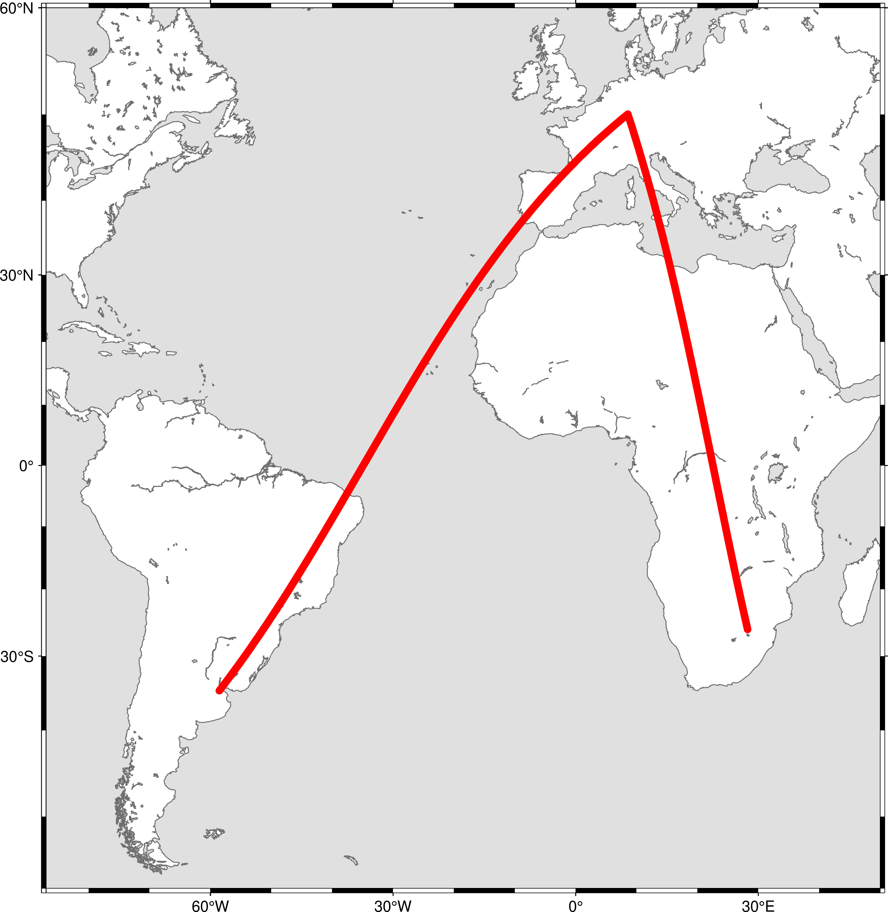

Lets add some labels to our two line segments. As we want different labels for each line we add the labels in the text file:

```
cat > flights.txt << END
> "Buenos Aires to Frankfurt - 11483 km in 12:24h"
-58.54 -34.82
  8.57  50.03
> "Frankfurt to Johannesburg - 8658 km in 9:21h"
  8.57  50.03
 28.24 -26.13
END
```

Now it is time to tackle the [`-Sq` argument](https://docs.generic-mapping-tools.org/latest/plot.html#s). We use `-Sqn1:+f12p,Helvetica-Bold+Lh+v` where `-Sq` indicates a quoted line, `n1` says "one centered label", `+f12p,Helvetica-Bold` specifies the font for the label to be 12p tall Helvetica-Bold, `+Lh` tells `plot` to look in the line headers for the label text and `+v` makes the label follow the line:

```
gmt begin symbols png
  gmt coast -JM0/20c -R-87/50/-57/60 -W0.5p,grey43 -Sgrey88 -A300 -B
  gmt plot flights.txt -W5p,red --PS_LINE_CAP=round \
    -Sqn1:+f12p,Helvetica-Bold+Lh+v
gmt end show
```

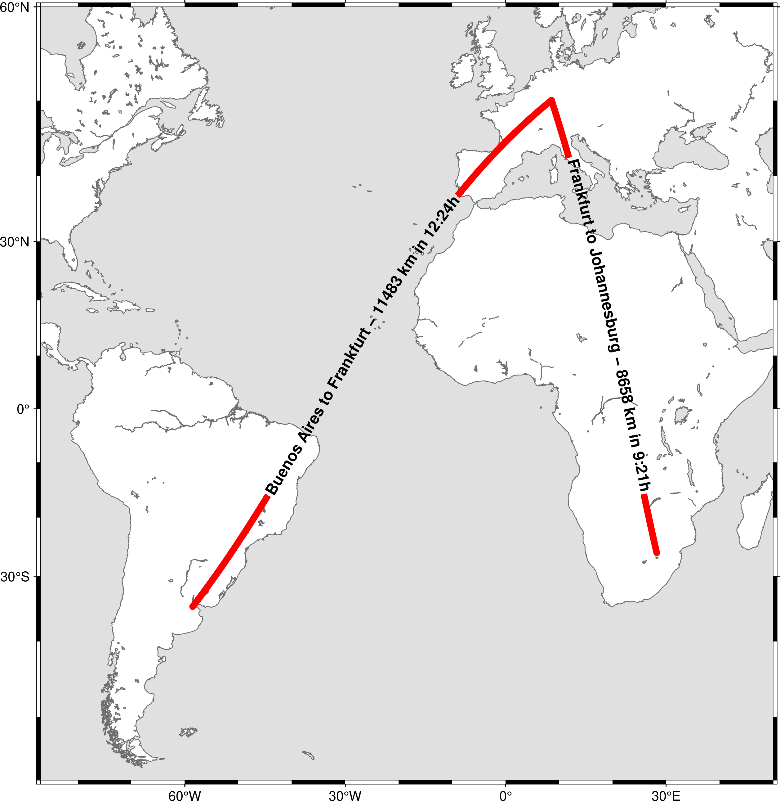

As we made such a beautiful label marker why not include it in the map:

```
gmt begin symbols png
  gmt coast -JM0/20c -R-87/50/-57/60 -W0.5p,grey43 -Sgrey88 -A300 -B
  gmt plot flights.txt -W5p,red --PS_LINE_CAP=round \
    -Sqn1:+f12p,Helvetica-Bold+Lh+v
  gmt plot flights.txt -Skmap_marker/0.5c
gmt end show
```

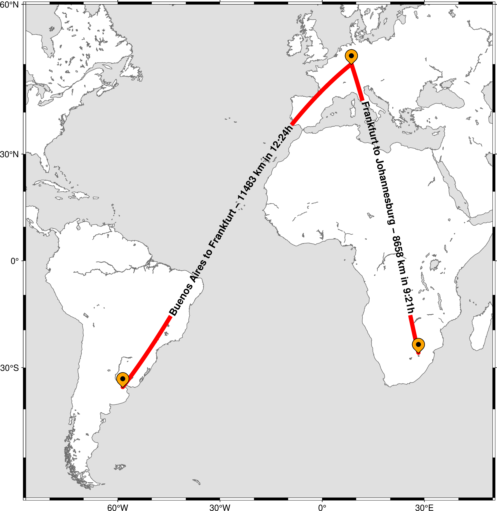

And, as a final touch, add some labels to the places. That needs to be done in the `flights.txt` file again:


And a call to the [`text` module](https://docs.generic-mapping-tools.org/latest/text.html) does the rest:

```
gmt begin symbols png
  gmt coast -JM0/20c -R-87/50/-57/60 -W0.5p,grey43 -Sgrey88 -A300 -B
  gmt plot flights.txt -W5p,red --PS_LINE_CAP=round \
    -Sqn1:+f12p,Helvetica-Bold+Lh+v
  gmt plot flights.txt -Skmap_marker/0.5c
  gmt text flights.txt -F+f12p,Helvetica-Bold+j -Dj11p/7p
gmt end show
```

Our final script in all its glory:

```
#!/usr/bin/env bash

cat > flights.txt << END
> "Buenos Aires to Frankfurt - 11483 km in 12:24h"
-58.54 -34.82 RB Buenos Aires
  8.57  50.03 LB Frankfurt
> "Frankfurt to Johannesburg - 8658 km in 9:21h"
  8.57  50.03 LB Frankfurt
 28.24 -26.13 RB Johannesburg
END

gmt begin symbols png
  gmt coast -JM0/20c -R-87/50/-57/60 -W0.5p,grey43 -Sgrey88 -A300 -B
  gmt plot flights.txt -W5p,red --PS_LINE_CAP=round \
    -Sqn1:+f12p,Helvetica-Bold+Lh+v
  gmt plot flights.txt -Skmap_marker/0.5c
  gmt text flights.txt -F+f12p,Helvetica-Bold+j -Dj11p/7p
gmt end show
```

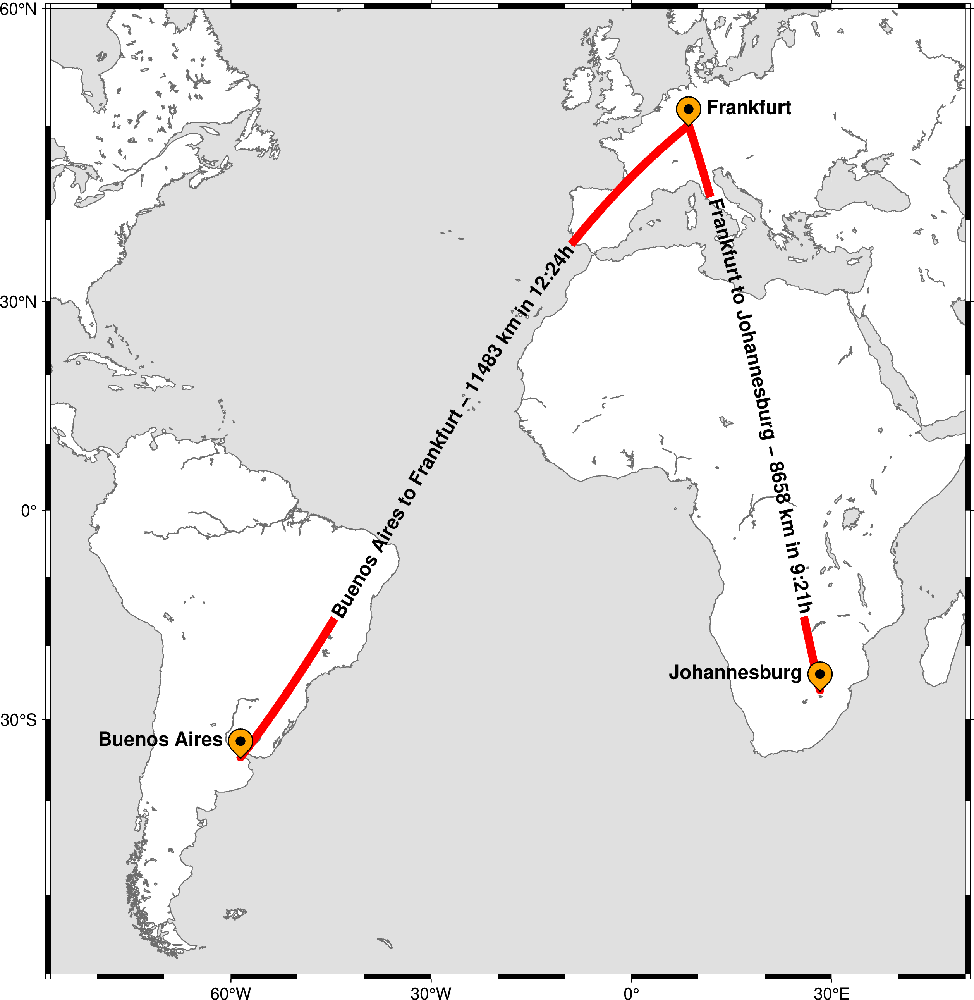

## Excercise 3

* Draw two Quoted Lines to two different cities on you continent and label the lines with the city names
* Fill the land polygon with an orange pattern of your choice