# Plotting grids and images

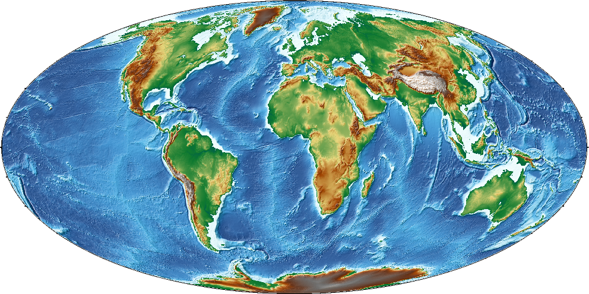

**Instructor:**
[Federcio Esteban](https://github.com/Esteban82)

## Topics

1. [GMT Remote Data sets](#1-gmt-remote-datasets)
2. [Plotting Satelital images](#2.-satelital-image-plots)
3. [Relief images](#3.-relief-plots)
4. [Adding hill-shade](#4_pseudo-color-plots)
5. [Plotting contours](#contour-plots)
6. [Group exercise](#group-exercise)
7. [Bonus](#bonus)


## 1. GMT Remote Data sets

Throughout this section, we'll use GMT's built-in Earth [remote data sets](https://docs.generic-mapping-tools.org/latest/datasets/remote-data.html#remote-data-sets). 

GMT offers several remote global data grids that you can access via our remote file mechanism. The first time you access one of these files, GMT will download the file and save it to the *server* directory under your GMT user directory [~/.gmt]. From then on we read the local file from there.

### Usage

In GMT, you may access such data by specifying the special name

 `@remote_name_rru`

  * **@**: tells GMT to search the files in the GMT servers.
  * **remote_name**: name of the remote data set.
  * **rru**: defines the desired resolution.

**Only** when used in plots the data resolution is optional. If it is not given then we determine a resolution that will result in a nice-looking image.

More info at: https://docs.generic-mapping-tools.org/latest/datasets/remote-data.html#usage

## 2. Satelital image plots

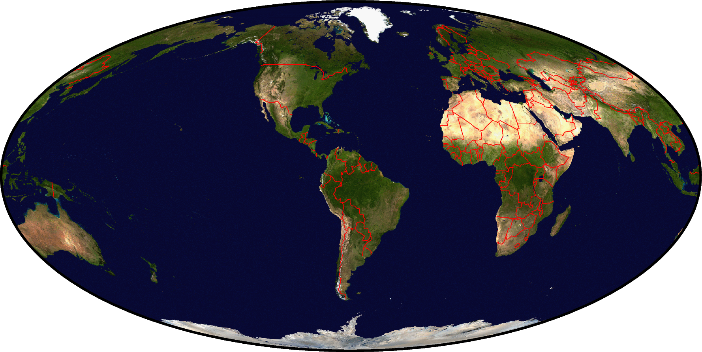

Let's start by making a satelitall image of the earth. The command for plotting images from grids or images in GMT is
[`grdimage`](https://docs.generic-mapping-tools.org/latest/grdimage.html).

We serve two [NASA image products](https://www.generic-mapping-tools.org/remote-datasets/earth-daynight.html):

* Blue Marble (Daytime view): @earth_day
* Black Marble (Nighttime view): @earth_night

Let's see script [`1_earth-day.sh`](1_earth-day.sh).

## 3. Relief plots

Each elevation data is paint with the same color.
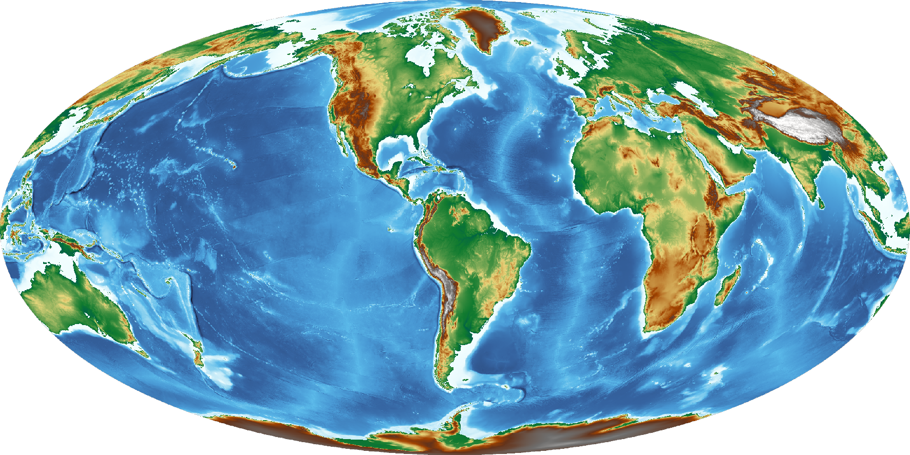

We serve four global relief grids:
* GEBCO: @earth_gebco
* GEBCO sub-ice: @earth_gebcosi
* SRTM15+v2.4: @earth_relief
* SYNBTATH_V1.2: @earth_synbath

Run script [`2_earth-day.sh`](2_earth-relief.sh) to make a relief map of the Caribbean Sea. The output should look like this:

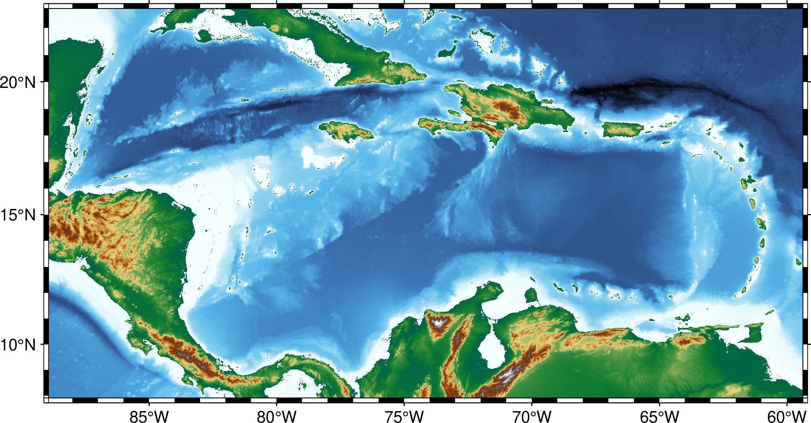

## 4.1. Color Palette Table (CPT)

In the previous map each elevation value was assinged to a color through a colormap or **color palette table** (CPT) as they are called in GMT.

By default, it will choose a CPT for you depending on the input grid. The Earth
relief data are automatically assigned to the topographic CPT named *geo*.
GMT has **many** CPTs: https://docs.generic-mapping-tools.org/latest/cookbook/cpts.html#of-colors-and-color-legends

### Exercise:
Go back to script [`2_earth-day.sh`](2_earth-relief.sh) and choose another CPT.

For example, if you choose the *oleron* CPT then the should look like this:

    gmt grdimage @earth_synbath -Coleron 

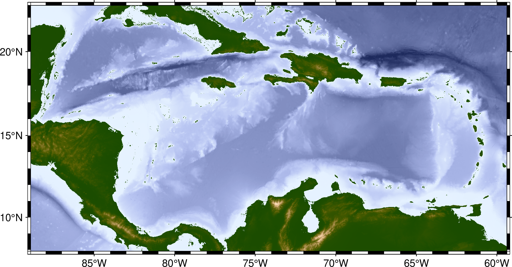

### 4.2. Color bar

As can be seen in the map above, it would be useful to add a color bar to see the relationship between colors and elavations.
For that, we use the module [`colorbar`](https://docs.generic-mapping-tools.org/latest/colorbar.html). To just add a colorbar with the defaults values use:

    gmt colorbar

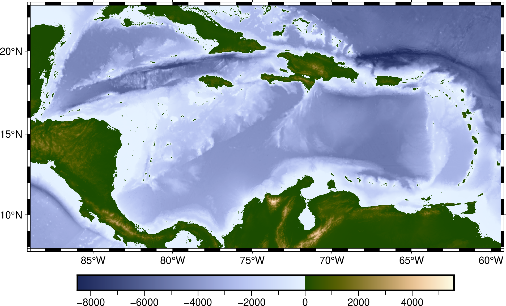


### Improving the Color bar

Within [`colorbar`](https://docs.generic-mapping-tools.org/latest/colorbar.html) there are many optional arguments to modify the default values:
* [-B](https://docs.generic-mapping-tools.org/latest/colorbar.html#b): Set annotions.
* [-D](https://docs.generic-mapping-tools.org/latest/colorbar.html#d): defines its location and dimensions.
* [-W](https://docs.generic-mapping-tools.org/latest/colorbar.html#w): scale the values.

For example, if you want a vertical colormap located to the right of the map, with a label and values expressed as km use: 


    gmt colorbar -DJRM -Baf -By+l"km" -W0.001

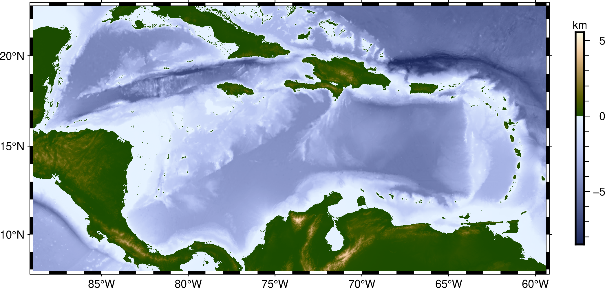

## 4. Hill shading

GMT supports automatic hill shading (adding a shadow effect to the image based
on the gradient of the data values). 
For the relief grids this can be done with [`grdimage -I`](https://docs.generic-mapping-tools.org/latest/grdimage.html#i) argument. To add a default hill shading efect just use:

    gmt grdimage @earth_synbath -Coleron -I+d


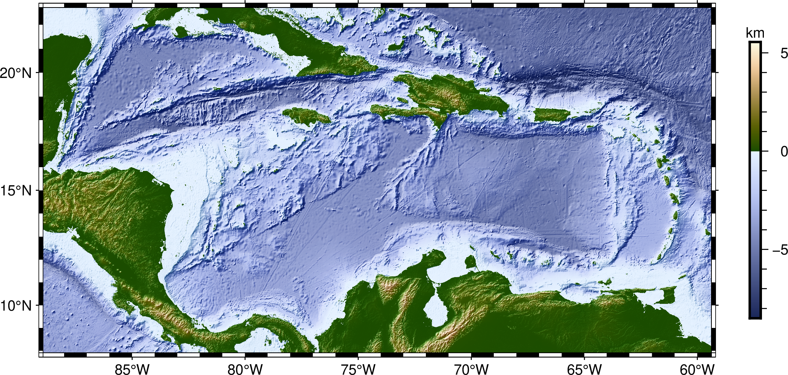

### Bonus. Adding Hill Shading effect to a Satellital Images

If you want to apply a Hill Shading efect to a satellital image you have to use 
[`grdgradient`](https://docs.generic-mapping-tools.org/latest/grdgradient.html) 
to calculate an intesity grid first.

See the script [`3_earth_day-shading.sh`](3_earth_day-shading.sh). The output should look like:

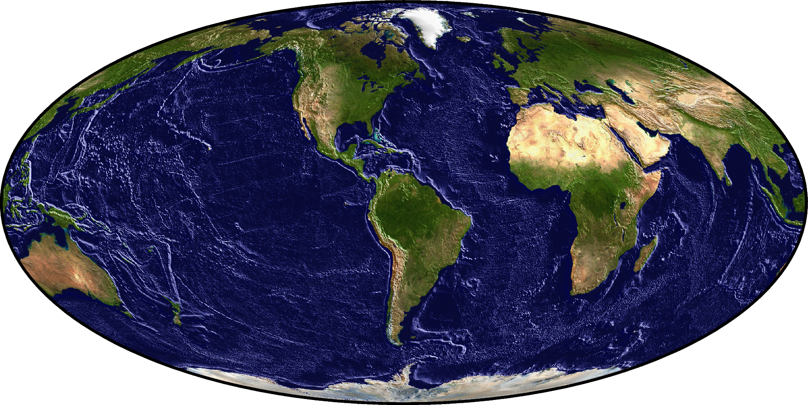


## 5. Contour plots

The command for making contour plots from grids is
[`grdcontour`](https://docs.generic-mapping-tools.org/latest/grdcontour.html).

By default, it will plot using black contours with a reasonable interval.
It has many options for configurations, which you are encouraged to explore.
You can make very nice looking plots with `grdcontour`.
#### Plot with the default contour arguments

We'll make contour plots of our Earth relief grid for Antarctica,
starting with the default options and adding some tweaks to make it look a bit
nicer.

See the script [`4_contours.sh`](4_contours.sh). The output should look like:

Basic map without contour lines. Coastlines draw in red.
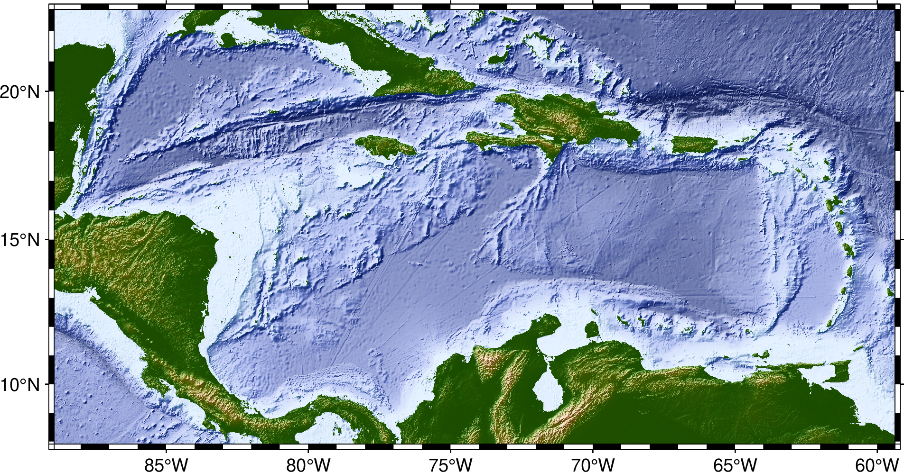

For adding default contour lines use:

    gmt grdcontour @earth_synbath_10m

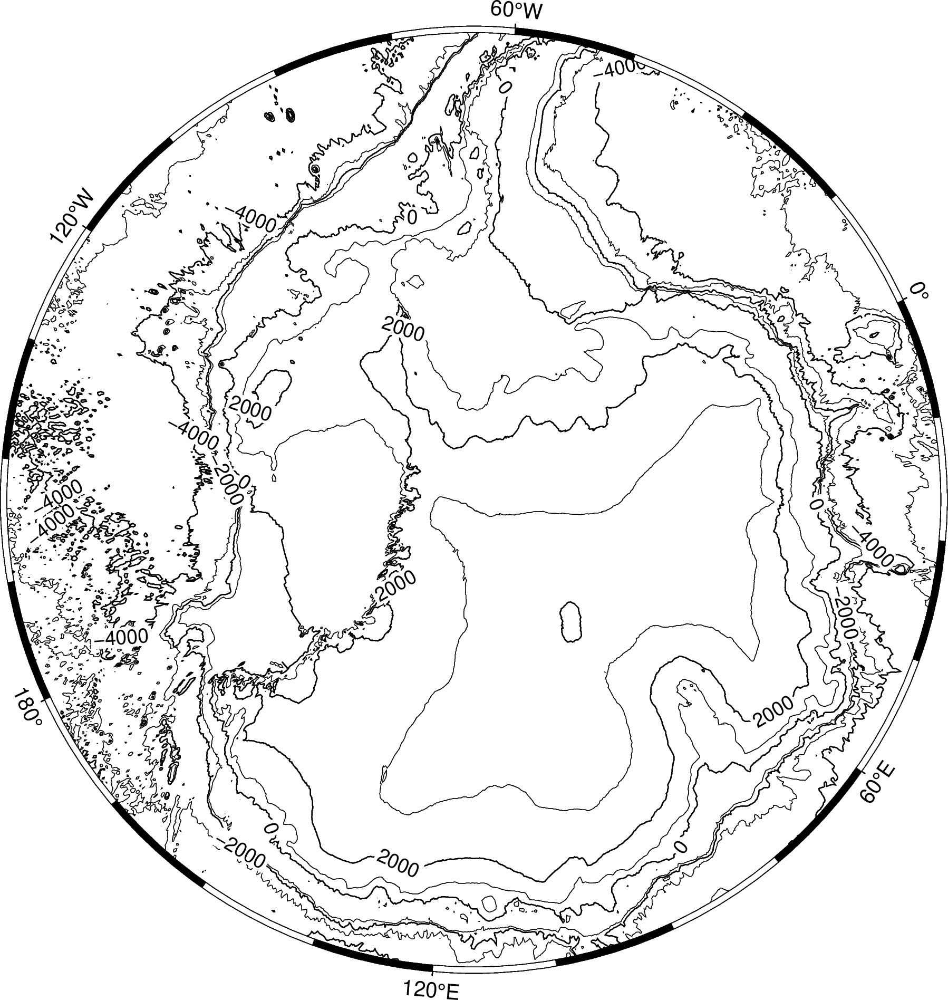

Note that the contour 0 do not exactly matches with the coastline because they are two different data sets.

To only draw the contour lines for negative values use:

    gmt grdcontour @earth_synbath_10m -Ln

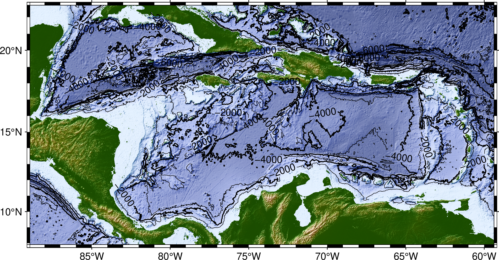

To NOT draw countour shorter than 100 km.

    gmt grdcontour @earth_synbath_10m -Ln -Q100k

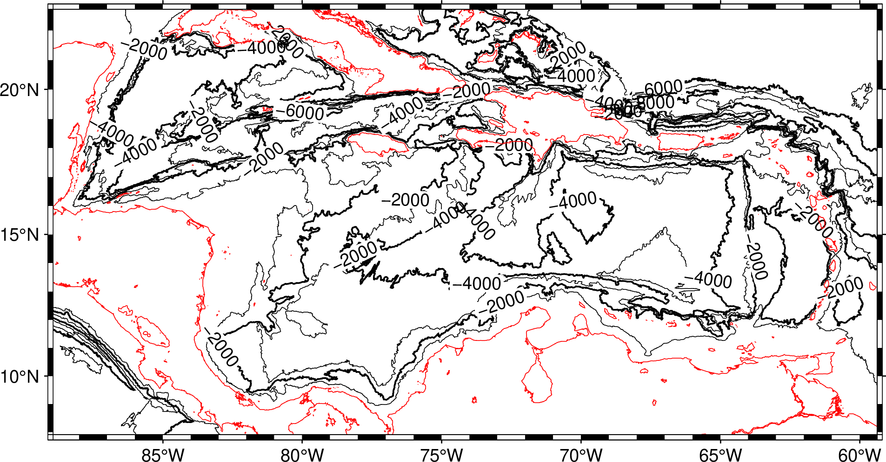


To now draw contours every 500 (m) use:


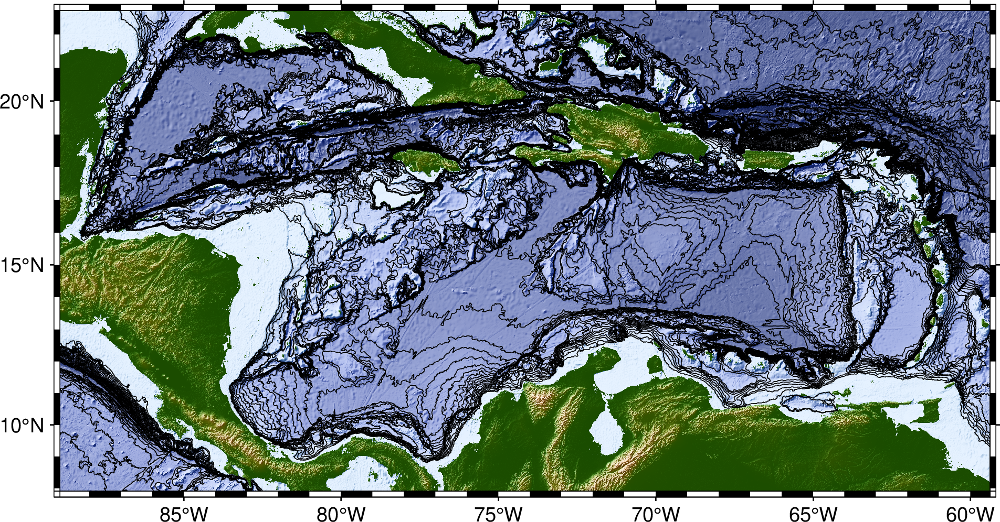


#### Customize the intervals and pens

Now we can tweak this a bit to specify intervals for regular and annotated
contours. We can also set the line thickness and color (i.e., the *pen*). See
the script [`contours-custom.sh`](contours-custom.sh). The output should look
like:

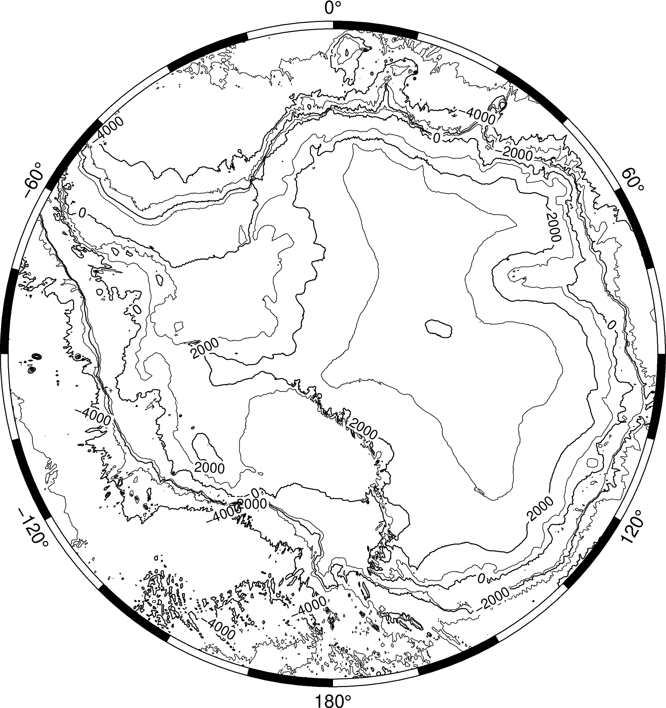

#### BONUS: Make a fancy plot using different colors for ocean and land

Take the customization further by layering two plots: one for the oceans (in
blue) and one for land (in gray). See the script
[`contours-fancy.sh`](contours-fancy.sh). The output should look like:

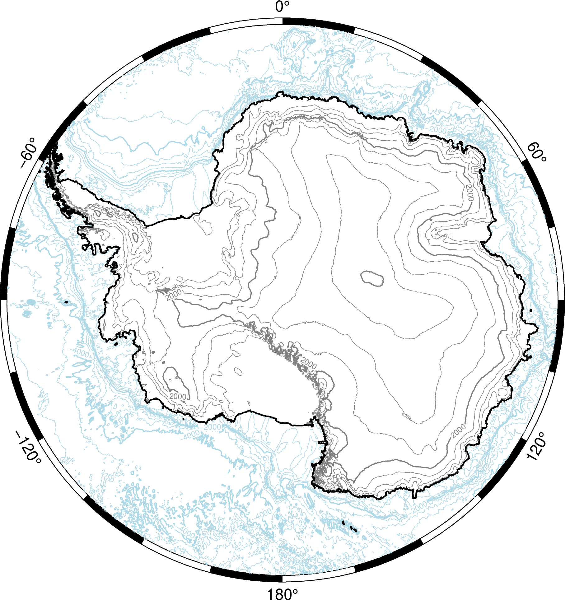

Full list of GMT color names: https://docs.generic-mapping-tools.org/latest/gmtcolors.html

## Group exercise

You will be split into teams to work on an exercise:

1. Discuss with your team which commands and options you would use
2. Work together to make a script that generates the desired plot
3. If you have any questions, ask on the Slack chatroom

**Make a relief map of a country of your choice:**

* Agree on which country you will map and find the [ISO country
  code](https://en.wikipedia.org/wiki/List_of_ISO_3166_country_codes) for that
  country (to use as the region)
* Choose a projection: https://docs.generic-mapping-tools.org/latest/cookbook/map-projections.html
* Make a hillshaded pseudo-color plot of Earth relief (with either default CPT
  or not)
* Overlay contours on your plot. Be careful not to make your plot too busy with
  the contours.
* Add a colorbar.
* BONUS: Add a label to the colorbar indicating that the units are meters.
* BONUS: Add a title to your plot.

You map should look something like this:

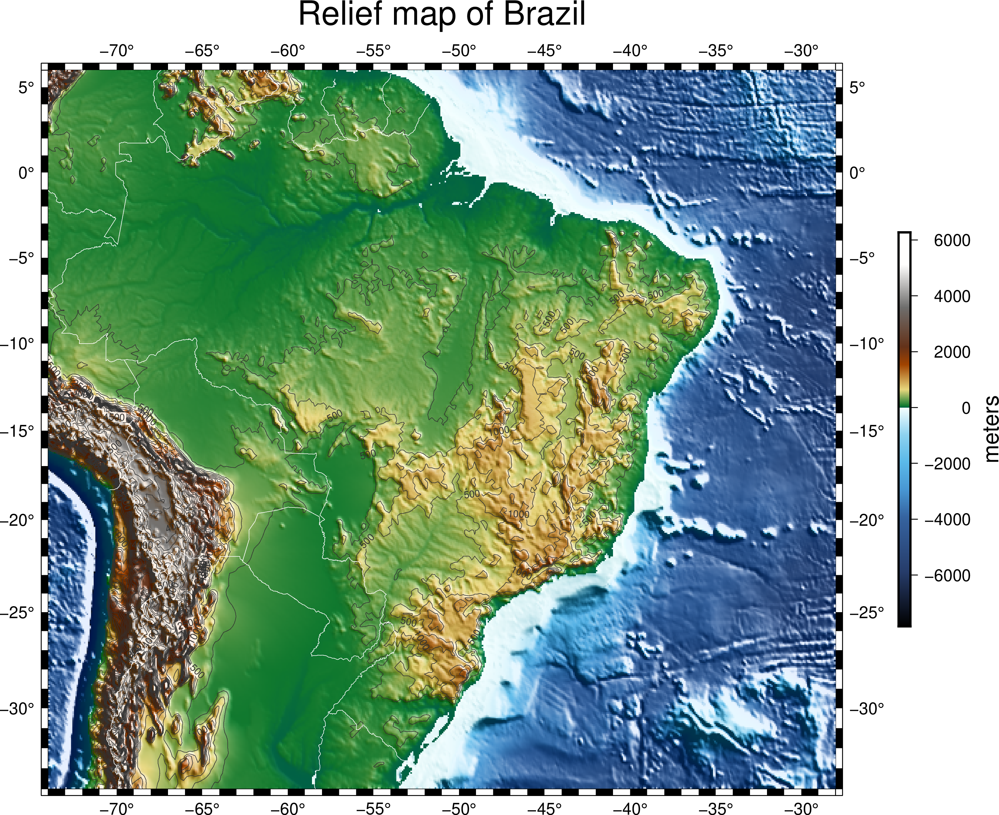


## Bonus
### Grid registration

The coordinates of grids and what the data values represent can be specified in
two ways (known as the grid *registration*):

* **Grid lines:** the coordinates correspond to the center of the area that is
  represented by the data value (where grid lines intersect)
* **Pixels:** the coordinates correspond to the borders of the area (pixel)


*Gridline (left) and pixel (right) registration of data nodes. The red shade
indicates the areas represented by the value at the node (solid circle).*

Grids are generated using one of the two options and it's **very important to
know which you have** (hint: `grdinfo` can tell you). The plotting modules in
GMT can usually automatically detect this. When generating output grids, you
can specify which one you want using the `-r` option.

Further reading: https://docs.generic-mapping-tools.org/latest/cookbook/options.html#grid-registration-the-r-option

Use `grdinfo` to figure out if the Earth relief grids are gridline or pixel
registered:

```
gmt grdinfo @earth_relief_10m
```

GMT actually distributes both versions of the Earth relief data. You can
specify which version you want by appending `_p` (for pixel) or `_g` (for
gridline) to the file name (for example, `@earth_relief_10m_p`).

Further reading: https://docs.generic-mapping-tools.org/latest/datasets/remote-data.html#global-earth-relief-grids
