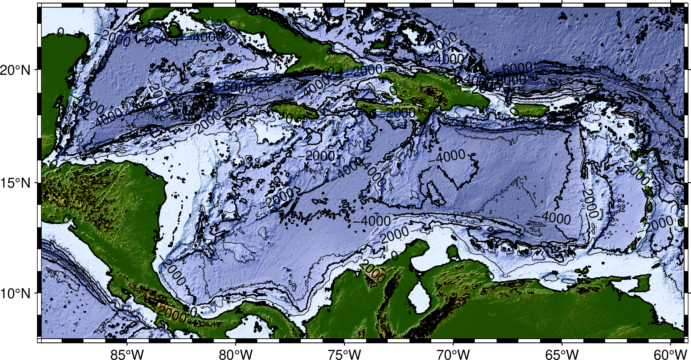
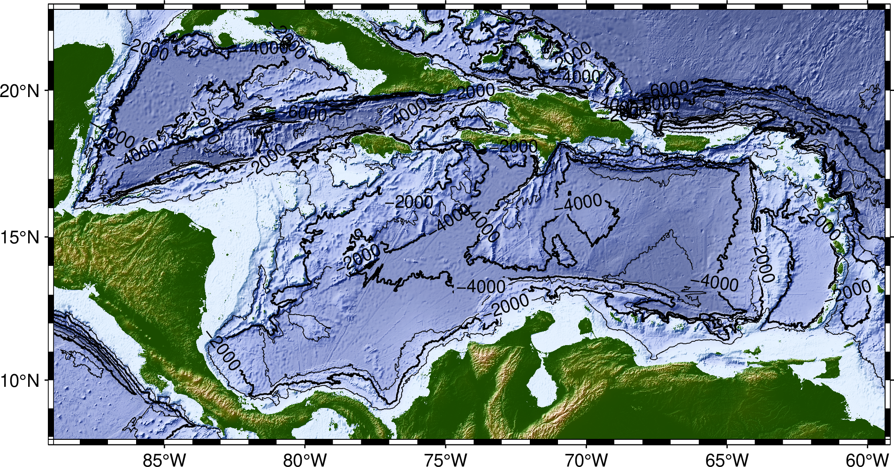

# Plotting grids and images


**Instructor:**
[Federico D. Esteban](https://github.com/Esteban82) (University of Buenos Aires)

## GMT Modules
* [grdimage](https://docs.generic-mapping-tools.org/latest/grdimage.html)
* [colorbar](https://docs.generic-mapping-tools.org/latest/colorbar.html)
* [grdgradient](https://docs.generic-mapping-tools.org/latest/grdgradient.html)
* [grdcontour](https://docs.generic-mapping-tools.org/latest/grdcontour.html)

## Topics

1. [GMT Remote Data sets](#1.-gmt-remote-data-sets)
2. [Plotting Satelital images](#2.-satelital-image-plots)
3. [Relief images](#3.-relief-plots)
4. [Color Palette Table (CPT)](#4.-color-palette-table-(cpt))
5. [Color bar](#5.-color-bar)
6. [Hill shading](#6.-hill-shading)
7. [DCW-Collections](#dcw-collections)
8. [Contour plots](#7.-contour-plots)

## 1. GMT Remote Data sets

Throughout this section, we'll use GMT's built-in Earth [remote data sets](https://docs.generic-mapping-tools.org/latest/datasets/remote-data.html#remote-data-sets).

GMT offers several remote global data grids that you can access via our remote file mechanism. The first time you access one of these files, GMT will download the file and save it to the *server* directory under your GMT user directory [~/.gmt]. From then on we read the local file from there.

**GMT user directory**: Run this code to show the full path
```
gmt --show-userdir
```
**Tip**: You can place your own data files in this directory as GMT programs will search for files here.

### **Currently available datasets**: 

Currently, there are 10 data sets available. You can see them [here](https://www.generic-mapping-tools.org/remote-datasets/index.html).

### **Usage**

In GMT, you may access such data by specifying the special name:

    @remote_name[_rru]

**Example**: To use a relief grid of the earth with 10 minute-arc resolution:
    
    @earth_relief_10m

  * **@**: tells GMT to search the files in the GMT servers.
  * **remote_name**: name of the remote data set.
  * **rru**: Defines the desired resolution and unit.

**Only** when used in plots the data resolution is optional. If it is not given then we determine a resolution that will result in a nice-looking image.

***

## 2. Satelital image plots

 

Let's start by making a satellite image of the earth. The command for plotting images from grids or images is
[`grdimage`](https://docs.generic-mapping-tools.org/latest/grdimage.html). 

We serve two [NASA image products](https://www.generic-mapping-tools.org/remote-datasets/earth-daynight.html):

* Blue Marble (Daytime view): @earth_day
* Black Marble (Nighttime view): @earth_night

### Exercise

Let's see script [`1_earth-day.sh`](1_earth-day.sh) to make the above maps.

***
## 3. Relief plots


Each elevation data is paint with the same color.

We serve four global relief grids:
* GEBCO: @earth_gebco
* GEBCO sub-ice: @earth_gebcosi
* SRTM15+v2.4: @earth_relief
* SYNBATH_V1.2: @earth_synbath


### Exercise:

Run script [`2_earth-relief.sh`](2_earth-relief.sh) to make a relief map of the Caribbean Sea. The output should look like this:


***
## 4. Color Palette Table (CPT)

In the previous map each elevation value was assigned to a color through a colormap or **color palette table** (CPT) as they are called in GMT. By default, it will choose a CPT for you depending on the input grid. 

The Earth relief data is automatically assigned to the topographic CPT named *geo*.
GMT has **many** CPTs: https://docs.generic-mapping-tools.org/latest/cookbook/cpts.html#of-colors-and-color-legends

### Exercise:
Go back to script [`2_earth-day.sh`](2_earth-relief.sh) and choose another CPT.

For example, if you choose the *oleron* CPT then the should look like this:

    gmt grdimage @earth_synbath -Coleron 


***
## 5. Color bar

As can be seen in the map above, it would be useful to add a color bar to see the relationship between colors and elavation.
For that, we use the module [`colorbar`](https://docs.generic-mapping-tools.org/latest/colorbar.html). To just add a colorbar with the defaults values use:

    gmt colorbar


### 5.1 Improving the Color bar

Within [`colorbar`](https://docs.generic-mapping-tools.org/latest/colorbar.html) there are many optional arguments to modify the default values:
* [-B](https://docs.generic-mapping-tools.org/latest/colorbar.html#b): Set annotations.
* [-D](https://docs.generic-mapping-tools.org/latest/colorbar.html#d): defines its location and dimensions.
* [-W](https://docs.generic-mapping-tools.org/latest/colorbar.html#w): scale the values.

For example, if you want a vertical colormap located to the right of the map, with a label and values expressed as km use: 


    gmt colorbar -DJRM -Baf -By+l"km" -W0.001


***
## 6. Hill shading

GMT supports automatic hill shading (adding a shadow effect to the image based
on the gradient of the data values). 
For the relief grids this can be done with [`grdimage -I`](https://docs.generic-mapping-tools.org/latest/grdimage.html#i) argument. To add a default hill shading effect just use:

    gmt grdimage @earth_synbath -Coleron -I


***
## Challenge: Adding Hill Shading effect to a Satellital Image

If you want to apply a Hill Shading effect to a satellite image you have to use 
[`grdgradient`](https://docs.generic-mapping-tools.org/latest/grdgradient.html) 
To calculate an intensity grid first.

See the script [`3_earth_day-shading.sh`](3_earth_day-shading.sh). The output should look like:


### DCW Collections

GMT also offers [collections](https://github.com/GenericMappingTools/dcw-gmt#dcw-collections). of countries and geographic regions to make your maps easily that include:
* 37 geographics region (e.g. Sahara Desert)
* 104 seas (e.g. Caribbean sea)
* 57 lakes, islands and archipelagos (e.g. Sicily Island)
* 4 continental sector of some countries (Continental Portugal)
* 46 list of countries (30 are from [UN49](https://unstats.un.org/unsd/methodology/m49/)).


### Usage:

You can use them using the TAG or its name:

	gmt coast -RScandinavia -Glightgray -B -pdf Scandinavia
	gmt coast -RIHO28 -Glightgray -B -pdf MediterraneanSea
	gmt coast -RSAM -Glightgray -B -pdf SouthAmerica

You can see the full list [here](https://github.com/GenericMappingTools/dcw-gmt/blob/master/dcw-collections.txt) or with this command:

    gmt pscoast -E+n


***
## 7. Contour plots

The command for making contour plots from grids is
[`grdcontour`](https://docs.generic-mapping-tools.org/latest/grdcontour.html).

By default, it will plot using black contours with a reasonable interval.
It has many options for configurations, which you are encouraged to explore.
We will use the following arguments to modify the contours:

* [-C](https://docs.generic-mapping-tools.org/latest/grdcontour.html#c): Sets the contour interval.
* [-L](https://docs.generic-mapping-tools.org/latest/grdcontour.html#l): Limit range.
* [-Q](https://docs.generic-mapping-tools.org/latest/grdcontour.html#q): Do not draw smaller contours.
* [-W](https://docs.generic-mapping-tools.org/latest/colorbar.html#w): set pen attributes for regular contour (-Wc) or annoted contours (-Wa).

### 7.1. Plot with the default contour arguments

We'll make contour plots of our Synbath relief grid for the Caribbean Sea, 
starting with the default options and adding some tweaks to make it look a bit nicer.

This is the base map (without contour lines) for the script [`4_contours.sh`](4_contours.sh).


For adding default contour lines just use:

    gmt grdcontour @earth_synbath



**Note**:  the contour 0 does not exactly matches with the coastline because they are two different data sets.

### 7.2. Limit range of contour lines

To only draw the contour lines for negative values (bathymetry) use:

    gmt grdcontour @earth_synbath -Ln


### 7.3. Only draw greatest contour lines

The previous map looks overloaded. You can filter out the contour lines shorter than 500 km with:

    gmt grdcontour @earth_synbath -Ln -Q500k



### 7.4. Sets the contour interval

On the previous map, the contour lines are drawn every 1000 m. If you want to draw contours every 200 (m) you can use:

    gmt grdcontour @earth_synbath -Ln -Q500k -C200


### 7.5. Customize the line properties

If you want to draw dark gray thinnest dashed contour lines you can use: 

    gmt grdcontour @earth_synbath -Ln -Q500k -C200 -Wc0,gray15,dashed 


### 7.6. Add annotated contour lines

Finally, you can use -A to add annotated contour lines. For example, if you want to add labels with font 5, within a white box with border for every 2000 contour line you can use:

    gmt grdcontour @earth_synbath -Ln -Q500k -C200 -Wc0,gray15,dashed -A2000+f5+p+gwhite -Wa0


## Final exercise

**Make a relief map of a country of your choice:**

* Choose a country. Find its [ISO country
  code](https://en.wikipedia.org/wiki/List_of_ISO_3166_country_codes) to use as the region.
* Choose a [projection](https://docs.generic-mapping-tools.org/latest/cookbook/map-projections.html).
* Make a hillshaded pseudo-color plot of Earth relief (with either default CPT
  or not).
* Overlay contours on your plot. Be careful not to make your plot too busy with
  the contours.
* Add a colorbar.
* BONUS: Add a label to the colorbar indicating that the units.
* BONUS: Add a frame around the colorbar.
* BONUS: Add a title to your plot.

Your map should look something like this:


If you have any questions, ask on the Slack chatroom, on the office hours and/or in the [GMT forum](https://forum.generic-mapping-tools.org/).

SOLUTION

Don't look at *one* [`solution`](5_excercise.sh) until you finish you own script.

## Bonus: Grid registration

The coordinates of grids and what the data values represent can be specified in
two ways (known as the grid *registration*):

* **Grid lines:** the coordinates correspond to the center of the area that is
  represented by the data value (where grid lines intersect)
* **Pixels:** the coordinates correspond to the borders of the area (pixel)


*Gridline (left) and pixel (right) registration of data nodes. The red shade
indicates the areas represented by the value at the node (solid circle).*

Grids are generated using one of the two options and it's **very important to
know which you have** (hint: `grdinfo` can tell you). The plotting modules in
GMT can usually automatically detect this. When generating output grids, you
can specify which one you want using the `-r` option.

Further reading: https://docs.generic-mapping-tools.org/latest/cookbook/options.html#grid-registration-the-r-option

Use `grdinfo` to figure out if the Earth relief grids are gridline or pixel
registered:

```
gmt grdinfo @earth_relief_10m
```

GMT actually distributes both versions of the Earth relief data. You can
specify which version you want by appending `_p` (for pixel) or `_g` (for
gridline) to the file name (for example, `@earth_relief_10m_p`).

Further reading: https://docs.generic-mapping-tools.org/latest/datasets/remote-data.html#global-earth-relief-grids

# Credits
The group excerise and bonus sections were taken from the [2021 edition](https://github.com/GenericMappingTools/2021-unavco-course/blob/main/grids/README.md) done by Leonardo Uieda.
