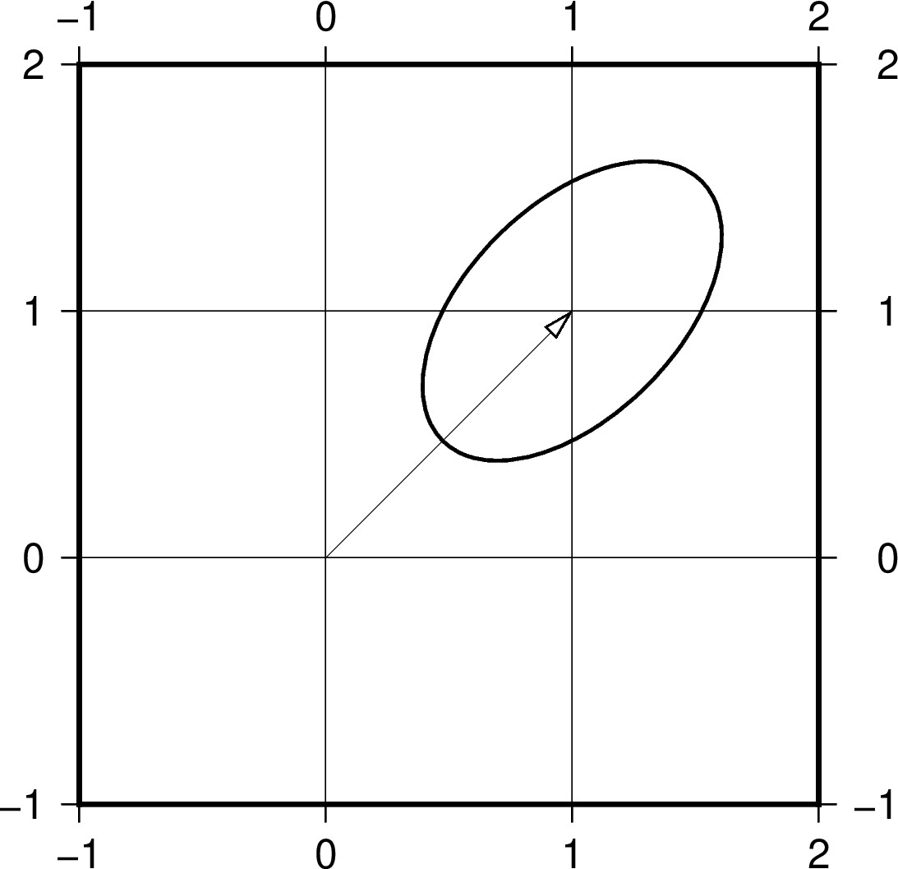
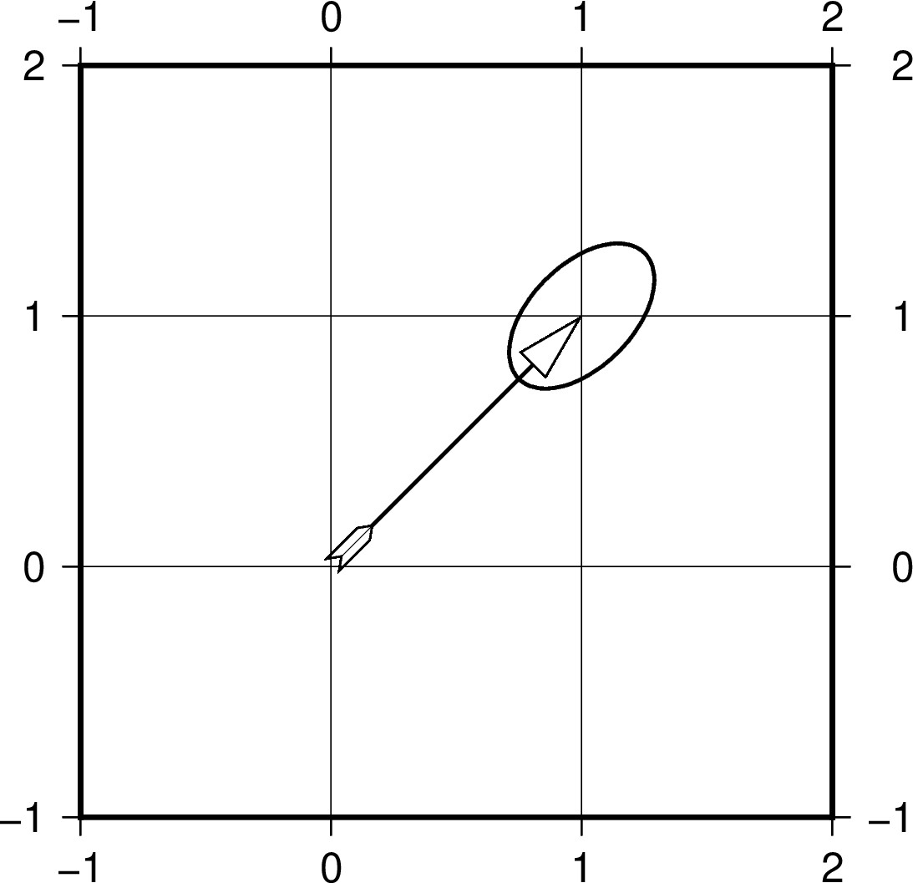
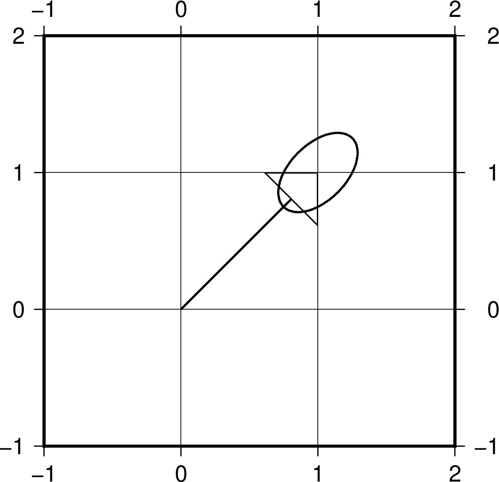
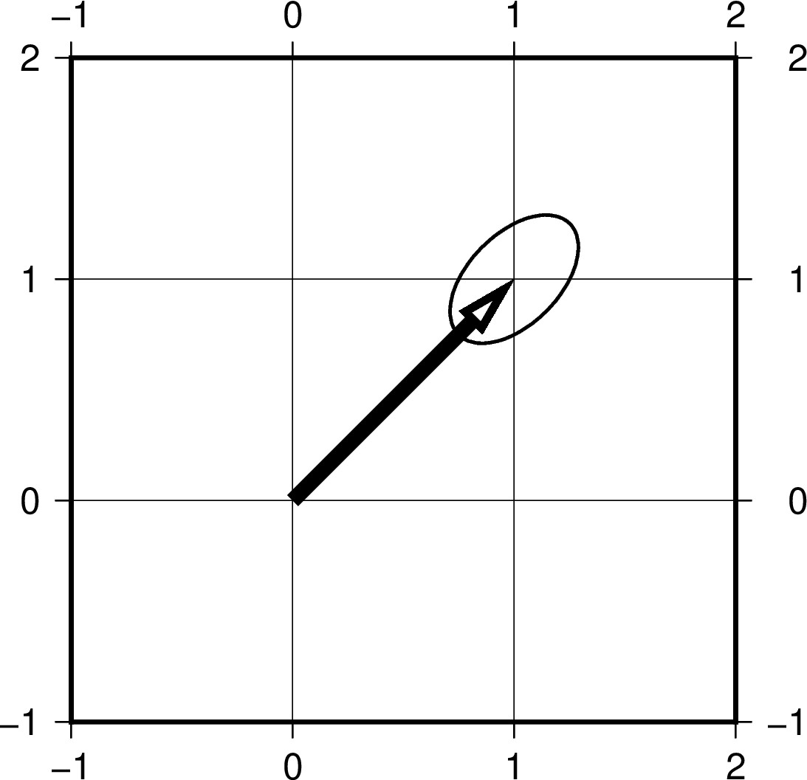
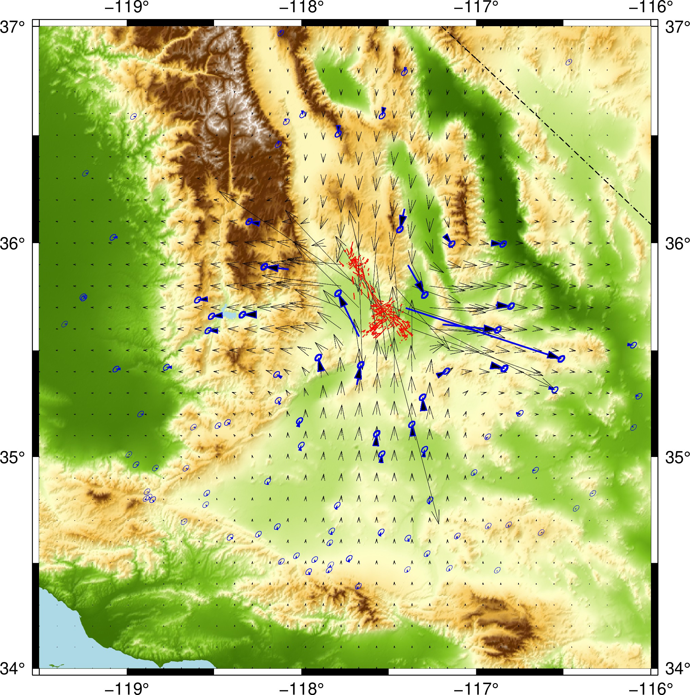

# Plotting deformation map with vectors

This part of the tutorial is to plot vector (GNSS) data. For gridded data go to https://github.com/GenericMappingTools/2020-unavco-course/tree/master/grids
Other data at https://drive.google.com/file/d/17NnXWIMeVl6IjMIrnsfXNHIBVeyY9Xtc/view?usp=sharing

## Topics
* [Vector attributes and examples](#vector-attributes)
* [Plotting deformation field with vectors - Ridgecrest earthquakes](#Plotting-deformation-field-with-vectors---Ridgecrest-earthquakes)

## Vector attributes and examples
This part we will experiment with plotting velocity vectors mainly using the ***gmt velo -Se*** command.

### Vector attributes
The ***-Se*** option allows to plot arrows with uncertainty ellipses, the followed options are ***-Se*velscale/confidence/fontsize**

The input file requires input of ***longitude latitude E-vel N-vel E-sig N-sig CorrEN [Sitename]***

The arrow attributes are mainly controlled by the ***-A[size]*** option with additional attributes that can be specified by 

***+a*** angle (of the arrow head apex, default 30)

***+b/e/m[t/c/a/i]*** placing arrow at ***b***eginning/***e***nd/***m***iddle of the vector with symbols of ***t***erminal-line/***c***ircle/***a***rrow/ta***i***l

***+g*** filling arrow color

***+p*** width of the vector line (note the common ***-W*** for ***-Se*** is the width of the uncertainty ellipse and the vector segment)

***+l/r*** plotting ***l***eft or ***r***ight half of the arrow

***+n[norm]*** ***n***ormalizing the vectors with decreasing length (norm/length)

### Examples
Below we will try these attributes with examples, first we'll create a script with the following command in your terminal
```
gmt --new-script > demo.sh
chmod +x demo.sh
```
Then open the script for editing in your script editor. Change the corresponding shell in the first line to your designated shell, and change the following lines to
```
echo "0 0 1 1 0.2 0.2 0" > tmp.dat
JRB="-JX3/3 -R-1/2/-1/2 -Ba1f1g1"
gmt begin vectors jpg
    gmt velo tmp.dat $JRB -Se1.0/0.65/10 -W1p
gmt end show
```
Inside we are plotting with 1.0 scale, and 0.65 confidence level corresponds to 1 sigma gaussian error. The resulting plot looks like 


If we change the ***-Se1.0/0.65/10*** to ***-Se1.0/0.99/10***, which correspond to 3 sigma, the circle will increase


If we then add a correlation of 0.5 between east and north error by replacing the ***echo*** line with ***echo "0 0 1 1 0.2 0.2 0.5" > tmp.dat***, the shape of the circle will be squeezed toward the correlated direction.



To learn about the attributes, we'll modify based on the following lines 
```
echo 0 0 1 1 0.2 0.2 0.5  > tmp.dat
JRB="-JX3/3 -R-1/2/-1/2 -Ba1f1g1"
gmt begin vectors jpg
    gmt velo tmp.dat $JRB -Se1.0/0.65/10 -W1p -A20p+ea
gmt end show
```
This will produce an ***A***rrow with an ***a***rrow at the ***e***nd of the vector that has the size of ***20p***


Then if we tweek the ***-A*** option to ***-A20p+ea+bi*** or ***-A20p+ea+gblue*** or ***-A20p+ea+a90*** or ***-A20p+ea+p5*** or ***-A20p+ea+l***

    

### Bonus challenge

How to plot a right-lateral strike slip sign like below?


## Plotting deformation field with vectors - Ridgecrest earthquakes
This part we will plot a vectorized deformation map + shaded dem + GNSS data + fault traces + etc ...

First we use the commands similar as above to create an executable script with a name called make_map.sh

Then we set up some variables inside the map
```
dem="dem_dsamp.grd"             # DEM file name
gps="GPS.dat"                   # GNSS data table
RR=`gmt grdinfo -I- $dem`       # use gmt grdinfo to get the range of longitude and latitude of the grid
output="demo"                   # output file name
format="jpg"                    # output file format
```
Then we could start plotting with the commands below. We'll first generate a basemap.
```
gmt begin $output $format
    gmt basemap -JM6 $RR -Ba1f0.5
gmt end show
```


Next we'll append lines to the script before ***gmt end show***, and continue our plotting. We'll plot shaded DEM first. The ***-I+nt.3*** is used to compute the shading based on a ***N***ormalized gradient with arc***t***angent transform, then scale to an amplitude of ***.3***. The ***C***olor table is chosen to be dem.cpt.
```
gmt grdimage $dem -I+nt.3 -Cdem.cpt
```


Following that the next step we plot we region for the area with the ***gmt coast*** command. Bellow we choose to plot ***a***ll ***N***ational boarders with ***0.5p*** thickness, ***black*** dashed dotted lines (-.-); wet region with (***-S***)light blue color; at ***f***ull ***D***efinition.  
```
gmt coast -Na/0.5p,black,-.- -Slightblue -Df
```


Then we prepare the deformation field vector data with GMT. GMT is a strong plotting tool as well as a powerful data processing code. Below we use ***gmt grdsample*** to downsample the east and north deformation field derived from a half-space source solution for the Ridgecrest earthquake sequence (see https://topex.ucsd.edu/SV_7.1/). We chose to downsample everything to an ***I***ncrement of ***0.1*** degree and then use ***gmt grd2xyz*** to output to text tables. Then we paste two tables together and output longitude, latitude, east, north, "0", "0", "0" to the a new table to be plotted with ***gmt velo***
```
gmt grdsample dE.grd -I0.1 -Gtmpe.grd
gmt grdsample dN.grd -I0.1 -Gtmpn.grd
gmt grd2xyz tmpe.grd > tmpe.lld
gmt grd2xyz tmpn.grd > tmpn.lld
paste tmpe.lld tmpn.lld | awk '{print $1,$2,$3,$6,"0","0","0"}' > defo.dat
```

Next, we plot these vectors with ***gmt velo***. We chose to plot them with a ***W***idth of ***0.1p***, ***black*** color. We plot the vectors at a scale of ***0.02***, with ***A***rrow head being ***10p*** size, plain ***A***rrow at ***e***nd, and ***n***ormalized with a norm size being ***10***.
```
gmt velo defo.dat -W0.1p,black -Se0.02/0.65/10 -A10p+eA+n10
```


Instead of using the above commands to fully control the sampling, one could also use the default ***gmt grdvector*** command to plot the arrows. Replace the above commands with 
```
gmt grdvector dE.grd dN.grd -S50 -I0.1 -W0.1p -Q10p+eA+n10
```
Note here the ***-S*** option is attached with scale factor that's a inverse of the ***velscale***.

Then we plot the new faults that are derived from surface fracture maps from a phase-gradient technique (see https://topex.ucsd.edu/SV_7.1/), with a ***W***idth of ***0.5p***, ***red*** line segments.
```
gmt plot new_faults.gmt -W0.5p,red
```


At last, we plot the GNSS data that are stored in a file named GPS.dat. This time, we plot the vector lines with a ***W***idth of ***0.5p***, ***blue*** color, filling the arrow head with (-G)***black*** color, with ***A***rrow head being ***10p*** size, fancy ***a***rrow at ***e***nd, and ***n***ormalized with a norm size being ***10***.
```
gmt velo $gps -W1p,blue -Gblack -Se0.02/0.65/12 -A10p+ea+n10
```



Last, we add some details like beach ball, epicenters, etc to the map.


### Bonus challenges

Figure out what's inside the final map and complete the rest of the plot. Focal mechanisms and epicenters can be found here: 7.1 https://earthquake.usgs.gov/earthquakes/eventpage/ci38457511/executive and 6.4 https://earthquake.usgs.gov/earthquakes/eventpage/ci38443183/executive

For the two methods of plotting deformation vectors, what are their differences? (run ***gmt grdinfo*** on the sampled grids)

Pick an event at the UNAVCO geophysical event response page https://www.unavco.org/projects/project-support/geophysical-event-response/geophysical-event-response.html and plot the GNSS vectors on top of earth relief. Search "GAGE GPS/GNSS Displacement Estimates" to locate the correct file. 

