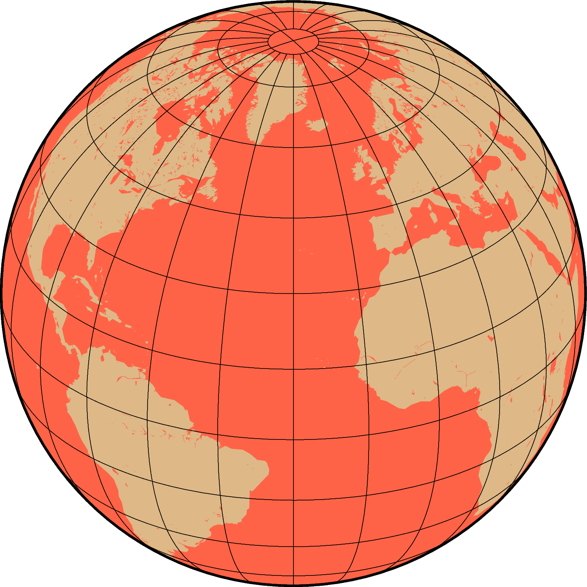
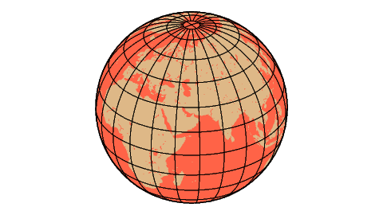
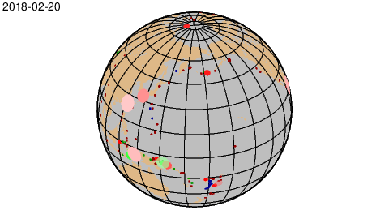

# GMT Animations

Resources for the GMT animation session:

**Instructor:**
[Paul Wessel](http://www.soest.hawaii.edu/wessel/)

**Resources**

* My Google Slides on [GMT animation](https://docs.google.com/presentation/d/1UoY0h1Y77YYAIsWc1yLSZK15PKyGk-aiZ4AxOTNhsiU/edit?usp=share_link)
* The [GMT YouTube](https://www.youtube.com/c/TheGenericMappingTools) channel

**Tasks**

* Understand GMT's approach to making animations
* Explore the **movie** module
* Explore the **events** module
* Make a few simple movies

**Common Problems**:

* Your **PATH** does not contain "." so you must type *./yourscript.sh* or *bash yourscript.sh* to run your script.
* You skipped making just a master frame and are now lost in **movie** errors.
* You asked for too many frames at too high resolution and it is taking too long.

Note: You can clean up the modern environment with

```
gmt clear sessions
```

**Products**

This session may build one or more scripts.  We are doing this together "live", but if you need to
go back and check you can examine my scripts here.  We recommend you work through the course
with us first before you open our scripts - they are there to help you later.

1. Our map of Earth viewed from (30W, 30N):



2. Our master frame from the spinning Earth script:



3. Our final spinning Earth movie (the MP4 at 360p is full 360 degrees)


4. Our final earthquake movie master frame:



5. Our final earthquake movie at 360p


