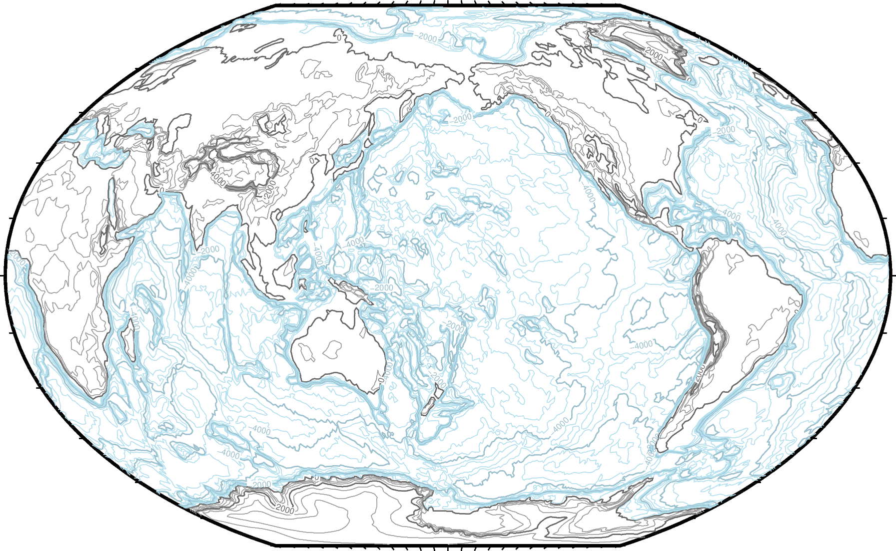
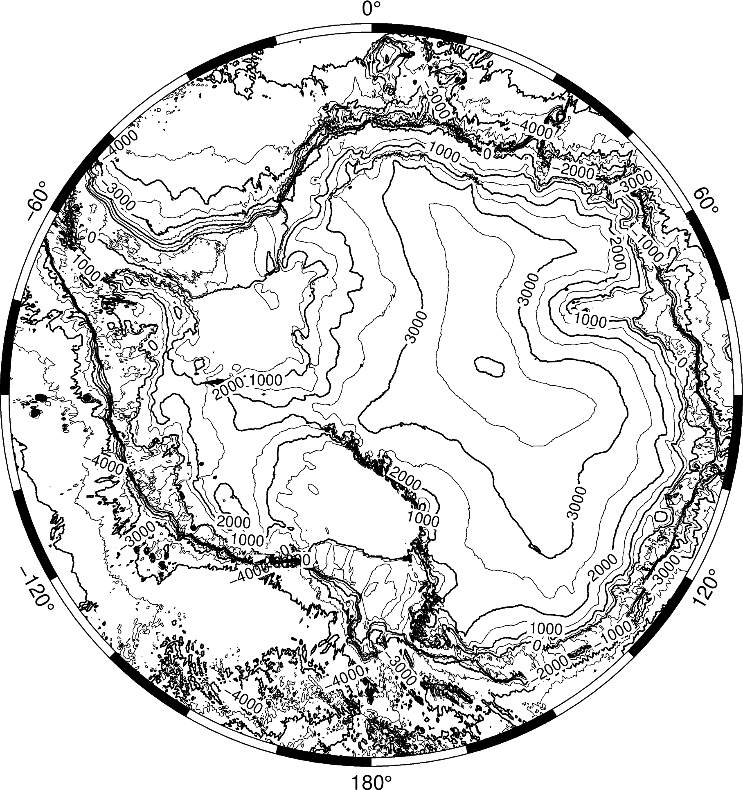
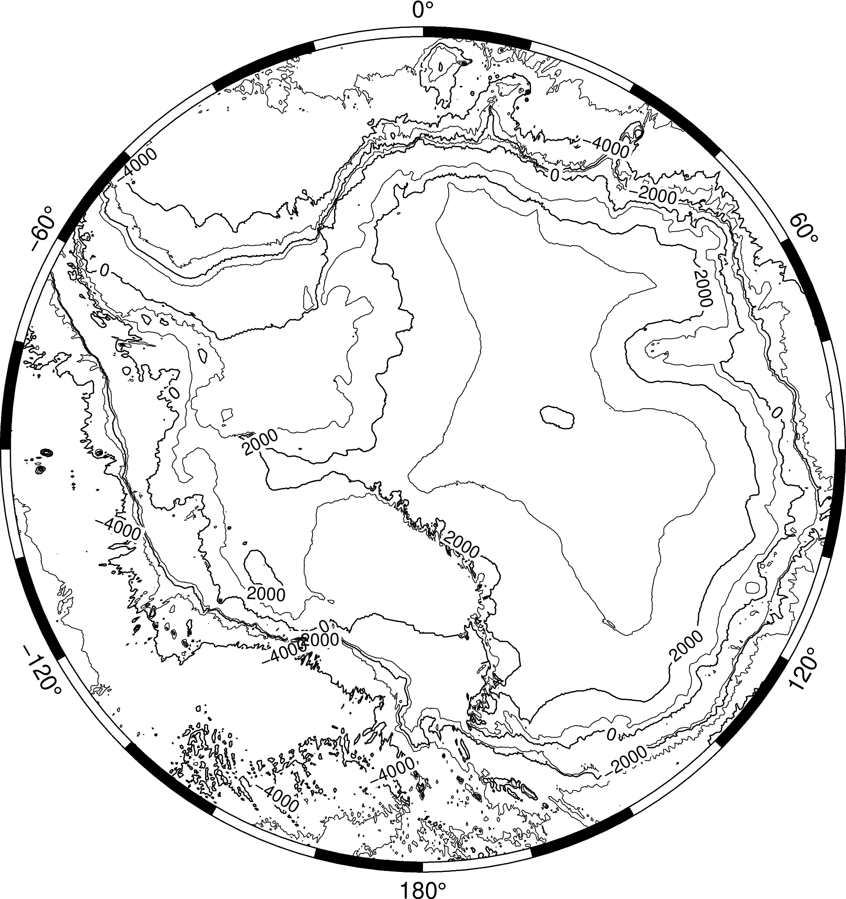
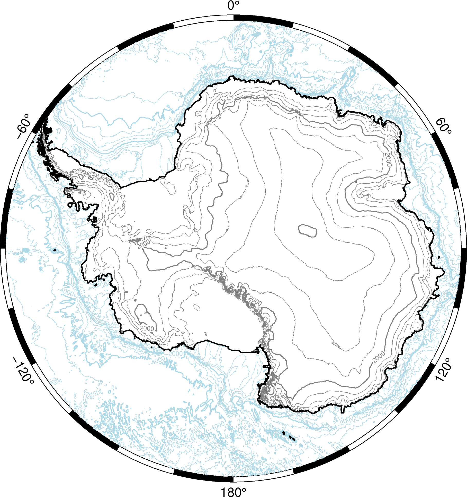
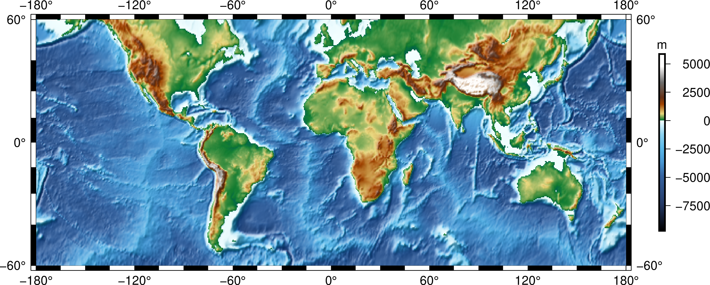
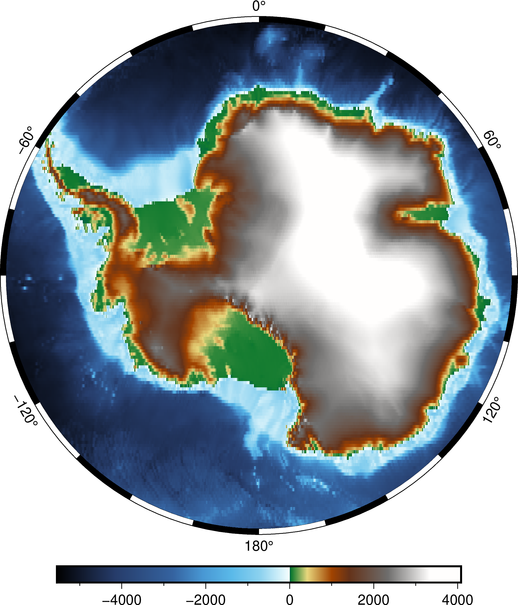
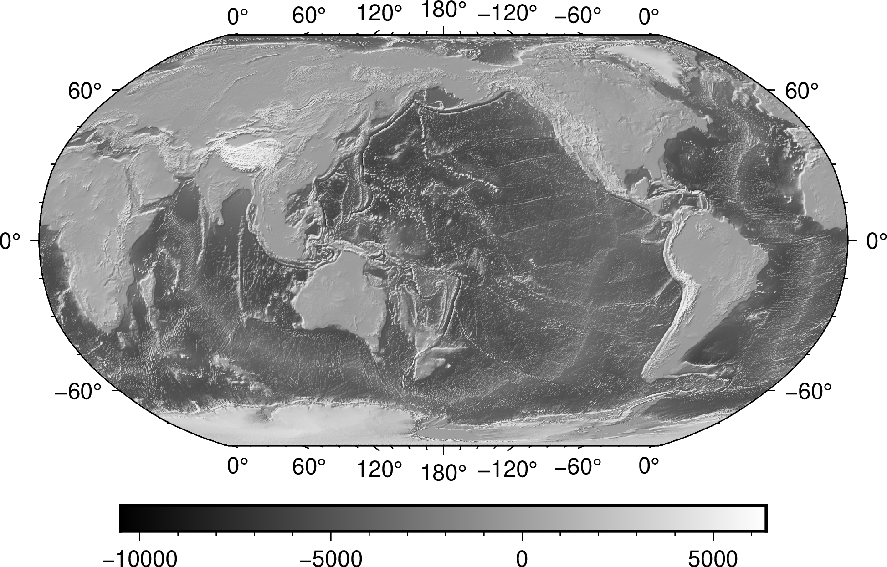
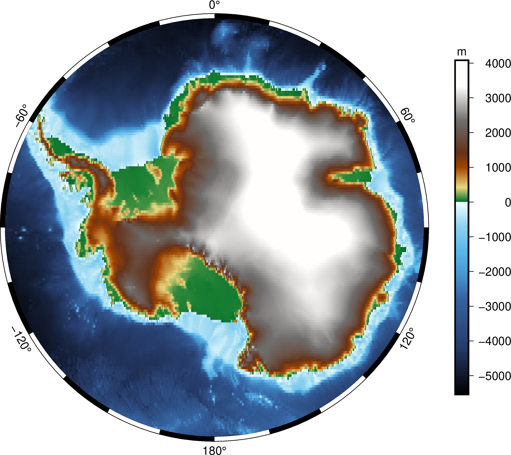
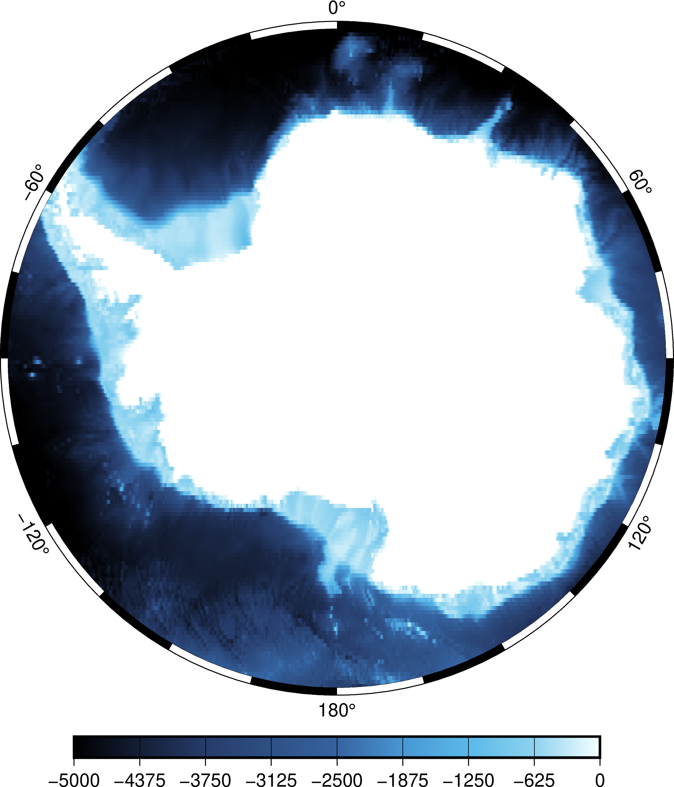
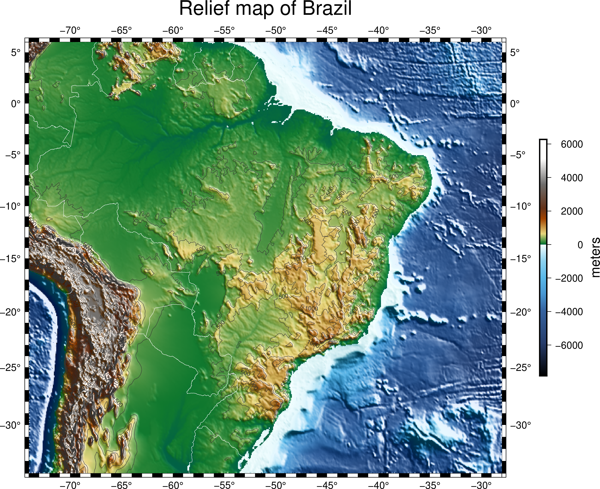

# Plotting grids and images


This part of the tutorial is dedicated to plotting gridded data in GMT: contour
plots, pseudo-color plots (images), etc.

## Topics

* [Main grid formats in GMT](#grid-formats)
* [Plotting contours](#contour-plots)
* [Plotting pseudo-color images](#pseudo-color-plots)
* [Group exercise](#group-exercise)

## Grid formats

The main file format GMT uses for grids is called **netCDF**:

> "self-describing, machine-independent data formats that support the creation,
> access, and sharing of array-oriented scientific data"
>
> https://en.wikipedia.org/wiki/NetCDF

The file contains information about:

* Data values on the grid
* Coordinates
* Metadata: units, projections, etc

All stored in a [binary file](https://en.wikipedia.org/wiki/Binary_file) that
support data compression and is widely accessible from other software (GIS,
Matlab, Python, etc).

Further reading: https://docs.generic-mapping-tools.org/latest/gmt.html#grd-inout-full

### Follow along

> Open a terminal and follow along with the exercise.

All GMT commands that operate on grids start with `grd`: `grdimage`,
`grdsample`, `grdcontour`, etc.

Throughout this section, we'll use GMT's built-in Earth relief grids. The grids
are available is several resolutions. They are downloaded automatically by GMT
when you use the special `@earth_relief_rru` file name. See
https://docs.generic-mapping-tools.org/latest/datasets/remote-data.html#global-earth-relief-grids

Use [`grdinfo`](https://docs.generic-mapping-tools.org/latest/grdinfo.html) to
get information about a grid file:

```
gmt grdinfo @earth_relief_10m
```

The option `-Cn` will print only numerical information about the grid (
`w e s n z0 z1 dx dy nx ny` by default):

```
gmt grdinfo @earth_relief_10m -Cn
```

Further reading: https://docs.generic-mapping-tools.org/latest/grdinfo.html

**BONUS**

Option `-o` can be combined with `-Cn` to select only one of the number printed
out. This is useful if you need to use this information as input for other
commands or assign them into *variables*. For example, we can get the grid
spacing in the x dimension:

```
gmt grdinfo @earth_relief_10m -Cn -o6
# Or store it in a variable with
dx=`gmt grdinfo @earth_relief_10m -Cn -o6`
```

## Contour plots

**Finally let's get to the plotting already!**
We'll start with *contour plots* first.



The command for making contour plots from grids is
[`grdcontour`](https://docs.generic-mapping-tools.org/latest/grdcontour.html).
By default, it will plot using black contours with a reasonable interval.
It has many options for configurations, which you are encouraged to explore.
You can make very nice looking plots with `grdcontour`.

Further reading: https://docs.generic-mapping-tools.org/latest/grdcontour.html

### Follow along

> Open VSCode (or your text editor of choice) and follow along with the
> exercise.

We'll make contour plots of our Earth relief grid for Antarctica,
starting with the default options and adding some tweaks to make it look a bit
nicer.

First, we need to set the `basemap` to the right region and use an appropriate
projection. For Antarctica, we will go with a
[South polar stereographic projection](https://docs.generic-mapping-tools.org/latest/cookbook/map-projections.html#polar-stereographic-map).
The region can be set using *ISO 3166 country code*. This is a 2-letter code
for every country/region in the world. GMT supports these codes as arguments to
`-R`. This means that we can specify the region for Antarctica as `-RAQ`:

Here is a list of ISO 3166 country codes: https://en.wikipedia.org/wiki/List_of_ISO_3166_country_codes

Further reading: https://docs.generic-mapping-tools.org/latest/cookbook/map-projections.html

#### Plot with the default contour arguments

See the script [`contours.sh`](contours.sh). The output should look like:



#### Customize the intervals and pens

Now we can tweak this a bit to specify intervals for regular and annotated
contours. We can also set the line thickness and color (i.e., the *pen*). See
the script [`contours-custom.sh`](contours-custom.sh). The output should look
like:



#### BONUS: Make a fancy plot using different colors for ocean and land

Take the customization further by layering two plots: one for the oceans (in
blue) and one for land (in gray). See the script
[`contours-fancy.sh`](contours-fancy.sh). The output should look like:



Full list of GMT color names: https://docs.generic-mapping-tools.org/latest/gmtcolors.html

## Pseudo-color plots

These are the maps you might be used to seeing. Each data value is
mapped to a color through a colormap or **color palette table** (CPT) as they
are called in GMT.



GMT has **many** CPTs: https://docs.generic-mapping-tools.org/latest/cookbook/cpts.html#of-colors-and-color-legends

The command for plotting pseudo-color images in GMT is
[`grdimage`](https://docs.generic-mapping-tools.org/latest/grdimage.html).
By default, it will choose a CPT for you depending on the input grid. The Earth
relief data are automatically assigned a topographic CPT.

Further reading: https://docs.generic-mapping-tools.org/latest/grdimage.html
and https://docs.generic-mapping-tools.org/latest/tutorial/session-4.html#color-images

### Follow along

> Open VSCode (or your text editor of choice) and follow along with the
> exercise.

We'll continue with our map of Antarctica relief but this time we'll use color
to represent values.

#### Using the defaults

First, plot the Earth relief data using the defaults, including a colorbar.
See the script [`images.sh`](images.sh). The output should look like:



#### Hill shading

GMT supports automatic hill shading (adding a shadow effect to the image based
on the gradient of the data values). You can also apply custom shading
(including shading one data type with another) using `grdgradient`.
See the script [`images-shading.sh`](images-shading.sh). The output should look like:



Further reading: https://docs.generic-mapping-tools.org/latest/grdgradient.html

#### BONUS: Placing and customizing the colorbar

We can control the placement of the colorbar using the `-D` option. We can also
set the annotation intervals and add axis labels using `-B` (just like for a
basemap).
See the script [`images-colorbar.sh`](images-colorbar.sh). The output should look like:



Further reading: https://docs.generic-mapping-tools.org/latest/colorbar.html

#### BONUS: Changing the CPT

Custom CPTs can be generated and configured with the `makecpt` command.
See the script [`images-cpt.sh`](images-cpt.sh). The output should look like:



Further reading: https://docs.generic-mapping-tools.org/latest/cookbook/cpts.html#of-colors-and-color-legends
and https://docs.generic-mapping-tools.org/latest/makecpt.html

## Group exercise

You will be split into teams to work on an exercise:

1. Discuss with your team which commands and options you would use
2. Work together to make a script that generates the desired plot
3. If you have any questions, ask on the Slack chatroom

**Make a relief map of a country of your choice:**

* Agree on which country you will map and find the [ISO country
  code](https://en.wikipedia.org/wiki/List_of_ISO_3166_country_codes) for that
  country (to use as the region)
* Choose a projection: https://docs.generic-mapping-tools.org/latest/cookbook/map-projections.html
* Make a hillshaded pseudo-color plot of Earth relief (with either default CPT
  or not)
* Overlay contours on your plot. Be careful not to make your plot too busy with
  the contours.
* Add a colorbar.
* BONUS: Add a label to the colorbar indicating that the units are meters.
* BONUS: Add a title to your plot.

You map should look something like this:



## EXTRA: Grid registration

The coordinates of grids and what the data values represent can be specified in
two ways (known as the grid *registration*):

* **Grid lines:** the coordinates correspond to the center of the area that is
  represented by the data value (where grid lines intersect)
* **Pixels:** the coordinates correspond to the borders of the area (pixel)


*Gridline (left) and pixel (right) registration of data nodes. The red shade
indicates the areas represented by the value at the node (solid circle).*

Grids are generated using one of the two options and it's **very important to
know which you have** (hint: `grdinfo` can tell you). The plotting modules in
GMT can usually automatically detect this. When generating output grids, you
can specify which one you want using the `-r` option.

Further reading: https://docs.generic-mapping-tools.org/latest/cookbook/options.html#grid-registration-the-r-option

Use `grdinfo` to figure out if the Earth relief grids are gridline or pixel
registered:

```
gmt grdinfo @earth_relief_10m
```

GMT actually distributes both versions of the Earth relief data. You can
specify which version you want by appending `_p` (for pixel) or `_g` (for
gridline) to the file name (for example, `@earth_relief_10m_p`).

Further reading: https://docs.generic-mapping-tools.org/latest/datasets/remote-data.html#global-earth-relief-grids
