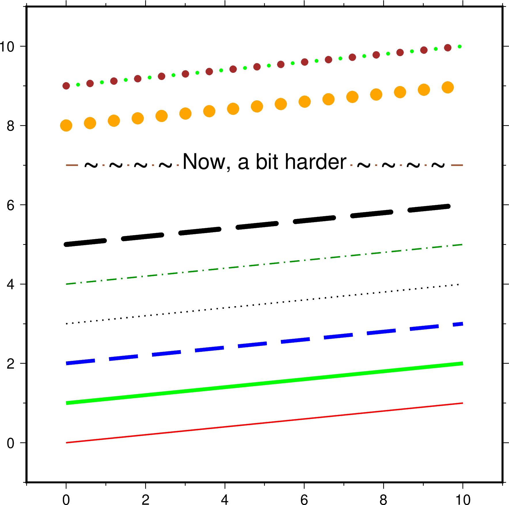
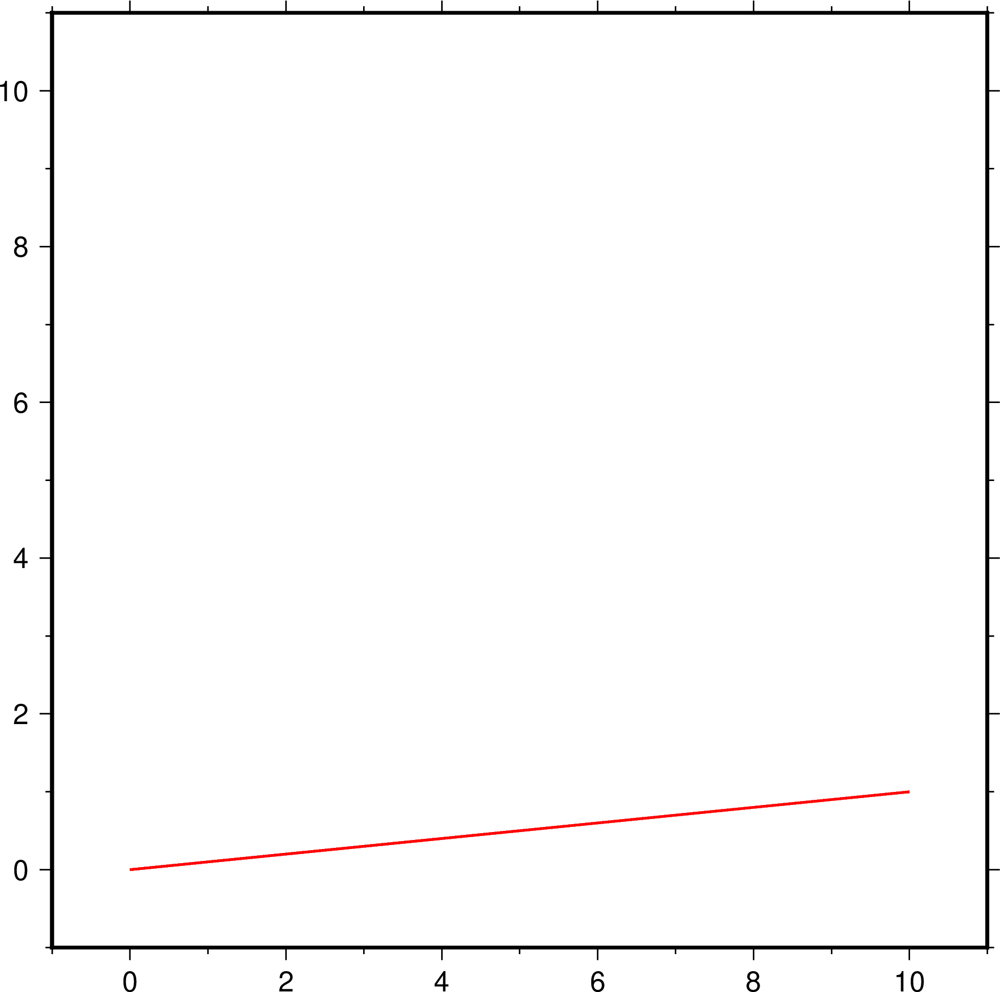
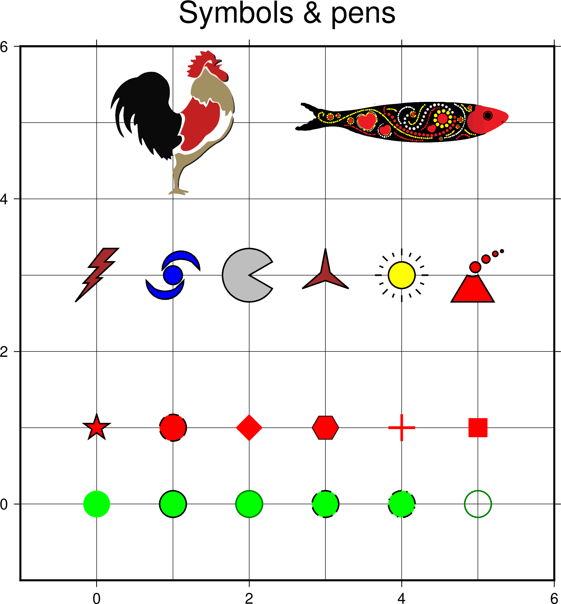
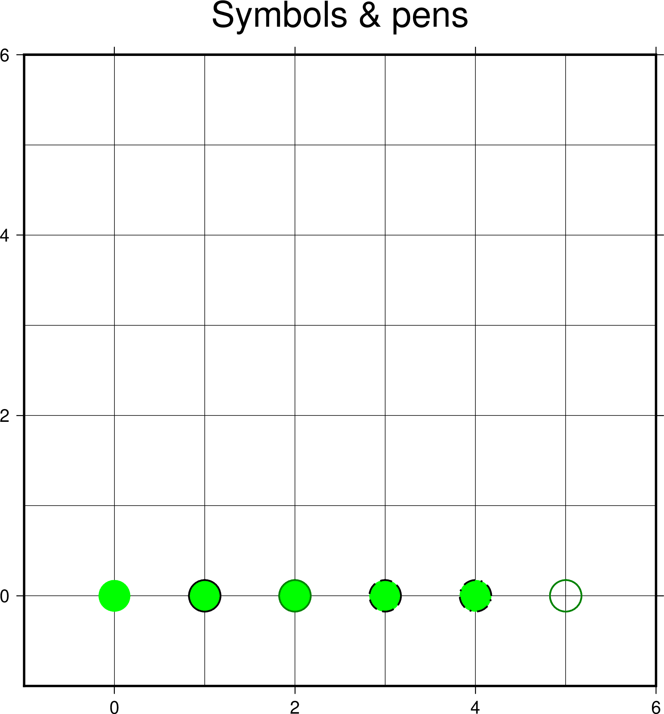
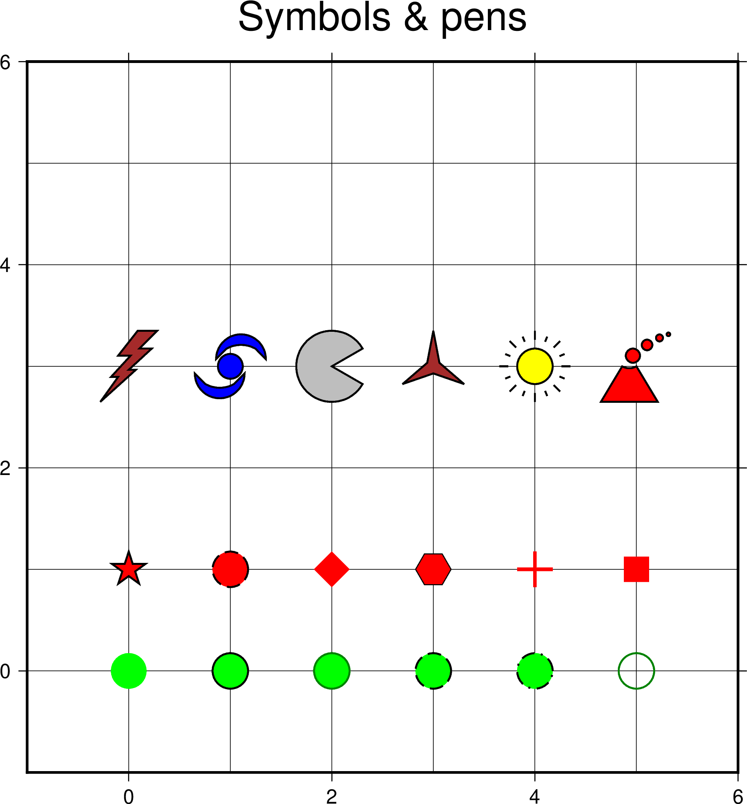
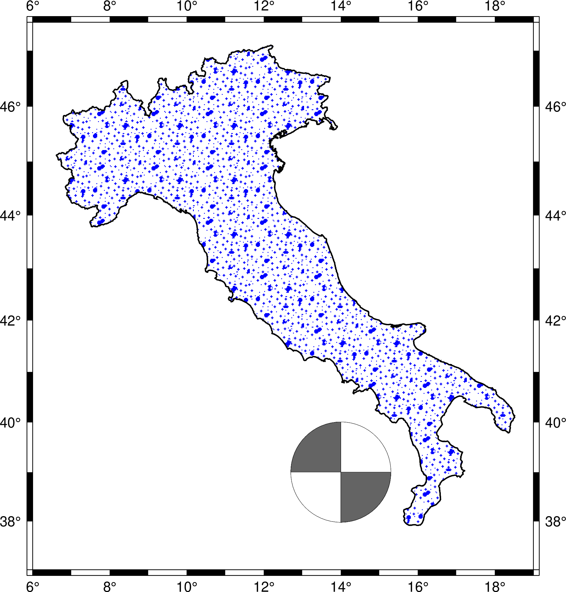

# Plotting Lines, symbols, pens & fills

The goals of this session is to show how to draw lines and symbols making use of the rich pen attributes and fill options.

## Topics

* [Line styles](https://docs.generic-mapping-tools.org/latest/cookbook/features.html#specifying-pen-attributes)
* [Symbols](https://docs.generic-mapping-tools.org/latest/plot.html#s)
* [Polygon filling](https://docs.generic-mapping-tools.org/latest/cookbook/features.html#specifying-area-fill-attributes)

## Drawing lines

Our final figure with an assemble of line styles



How to create it? Open a terminal and the VisualStudio editor. In the editor type
```
	#!/usr/bin/env bash
	# Examples of lines with different pen settings

	gmt begin lines png
		# Create a file with the line start and end points
		echo  0 0  > t.dat
		echo 10 1 >> t.dat

		# Plot a continuous red line with thickness of 1 point (1 point = 1/72 inch)
		gmt plot t.dat -R-1/11/-1/11 -JX14 -Baf -BWSen -W1,red
	gmt end show
```

Run the script and will see this boring figure



Now add instructions to plot another line

```
	echo  0 1  > t.dat
	echo 10 2 >> t.dat
	gmt plot t.dat -W3,green
```

*Note* that we generate the line again to not everlap the first one

The script that plots all lines (some are less boring, we hope) is [`lines.sh`](lines.sh).


## Drawing symbols

At the end we will generate this figure



In your text editor create a script with

```
	#!/usr/bin/env bash
	# Examples of symbols with different filling and outline pens

	gmt begin symbols png
		echo 0 0 | gmt plot -R-1/6/-1/6 -JX15/15 -BWSen+t"Symbols & pens" -Ba2g1 -Ggreen -Sc0.75c
		echo 1 0 | gmt plot -Ggreen -W1,black -Sc0.75c
		echo 2 0 | gmt plot -Ggreen -W1,0/130/0 -Sc0.75c
		echo 3 0 | gmt plot -Ggreen -W1,black,dashed -Sc0.75c
		echo 4 0 | gmt plot -Ggreen -W1,black,-. -Sc0.75c
		echo 5 0 | gmt plot -G- -W1,0/130/0 -Sc0.75c
	gmt end show
```

This plots circles with the same size (0.75 cm diameter) and different colors and outline pens



adding these more plots other symbols (star, diamond, square, etc...)

```
	echo 0 1 | gmt plot -Gred -W1,black -Sa0.75c
	echo 1 1 | gmt plot -Gred -W1,black,dashed -Sc0.75c
	echo 2 1 | gmt plot -Gred -Sd0.75c
	echo 3 1 | gmt plot -Gred -W0.5,black -Sh0.75c
	echo 4 1 | gmt plot -W2,red -S+0.75c
	echo 5 1 | gmt plot -Gred -Ss0.75c
```

but when things start to be more interesting is when we make use of GMT's own custom symbols.
There is a default set of [`custom symbols`](https://docs.generic-mapping-tools.org/latest/cookbook/custom-symbols.html?highlight=custom%20symbols#custom-plot-symbols) 
that comes with GMT and several more contributed by users ([`wales and dolphins`](https://docs.generic-mapping-tools.org/latest/users-contrib-symbols.html#biology-symbols),
[`geological`](https://docs.generic-mapping-tools.org/latest/users-contrib-symbols.html#structural-geology-symbols))
and you can even build your own symbols using the symbols [`macro language`](https://docs.generic-mapping-tools.org/latest/cookbook/custom-symbols.html?highlight=custom%20symbols#the-macro-language)


Add this and we get another row, this time with the custom symbols
```
	echo 0 3 | gmt plot -Gbrown -W1 -Skflash/1.5c
	echo 1 3 | gmt plot -Gblue -W1 -Skhurricane/1.5c
	echo 2 3 | gmt plot -Ggray -W1 -Skpacman/1.5c
	echo 3 3 | gmt plot -Gbrown -W1 -Skstar3/1.5c
	echo 4 3 | gmt plot -Gyellow -W1 -Sksun/1.5c
	echo 5 3 | gmt plot -Gred -W1 -Skvolcano/1.5c
```



For even more elaborated symbols we can use EPS (encapsulated Postscript) files directly.
These two are stored in the GMT server and will be download directly by GMT (the leading ``@`` is
the responsible for that automatic download).

```
	echo 1 5 | gmt plot -Sk@gallo/3.5c
	echo 4 5 | gmt plot -Sk@sardinha/6c
```

The full script that plots all symbols displayed at the begining of this topic can be found here [`symbols.sh`](symbols.sh).

## Polygon filling

To exemplify how to paint polygons we will extract the outline of Italia and use it in our example. In the editor
create a script called *italia_I.sh* with

```
#!/usr/bin/env bash
# Extract the ouline of mainland Italia and use it as example for filling polygons
# The more cryptic command to extract the polygon is due to the fact that for demonstration
# sake we only want the main country polygon (i.e., drop all islands and islets)

gmt pscoast -EIT -M | gmt convert -C+l3000 -bof > italia.bin 
gmt begin italia_I png
	gmt plot italia.bin -bi2f -R6/19/37/47.5 -JM15 -Baf -W1 -Gp32+r100+fblue
	echo 14 39 | gmt plot -Skmeca/3c -G100 -Wfaint
gmt end show
```

Here we are using a [`patern`](https://docs.generic-mapping-tools.org/latest/cookbook/predefined-patterns.html#predefined-bit-and-hachure-patterns-in-gmt) picked from the GMT pattern collection for the polygon fill
(but we could have used simply a constant color like for example *-Glightblue*). Run the script and we get.



## Group exercise

You will be split into teams to work on an exercise:

1. Discuss with your team which commands and options you would use
2. Work together to make a script that generates the desired plot
3. If you have any questions, ask on the Slack chatroom

**Make a maps similar to this but with different colors and symbols**


1. Use different line styles to draw the itlian border
2. Paint Italy with different colors and patterns
3. Replace the *beach ball* with other symbols.
4. Try to plot a different symbol for each of *beach ball* positions

Don't look at *one* [`solution`](italia_II.sh).
